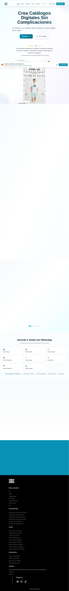

# 01 — Home (landing público)

- **URL:** `https://mareaalcalina.com/`
- **Momento del flujo:** exploración inicial, usuario anónimo.
- **Objetivo en el clon:** replicar el propósito y la estructura de la
  landing con marca, textos e imágenes propias.

## Acción realizada (Playwright)

1. `browser_navigate` a la raíz.
2. `browser_snapshot` para capturar el árbol accesible.
3. `browser_take_screenshot` full-page.
4. `browser_evaluate` para listar headings y enlaces del header/footer.

## Elementos de UI observados

- **Header sticky** con navegación principal: Inicio · Planes · Agencias ·
  Crear · Recursos (dropdown) · selector de idioma `ES` · Iniciar Sesión ·
  Registrarme (CTA principal).
- **Hero** con título grande (H1) y dos CTAs.
- Grilla de features (pedidos por WhatsApp, pagos flexibles, entregas,
  panel, analíticas, stock).
- Sección "Plataforma en acción" con cards (IA para catálogo, editor de
  bloques, reconocimiento de imágenes, gestión de pedidos, dominio propio,
  pagos).
- Strip de verticales por industria con emojis.
- Testimonios.
- CTA final y footer multi-columna.

## Qué construir en el clon

- Ruta `app/page.tsx` (RSC + ISR).
- Componentes: `SiteHeader`, `Hero`, `FeatureGrid`, `FeatureShowcase`,
  `VerticalsStrip`, `TestimonialsSlider`, `CTASection`, `SiteFooter`.
- Metadata SEO con OG propia.
- Cookie banner básico, selector de idioma con `next-intl`.

## Notas de implementación

- Lista de verticales del strip sirve como seed para las landings SEO
  `/como-vender/[slug]`.
- Los links del footer alimentan el sitemap.
