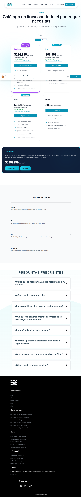

# 02 — Planes / Pricing

- **URL:** `https://mareaalcalina.com/plans`
- **Momento del flujo:** usuario comparando planes antes de registrarse.
- **Objetivo en el clon:** página pública de precios con toggle y
  multi-moneda, tabla de comparación y FAQ.

## Acción realizada (Playwright)

1. `browser_navigate` a `/plans`.
2. `browser_evaluate` para extraer headings y texto de las cards.
3. `browser_take_screenshot` full-page.

## Elementos de UI observados

- Encabezado con título y subtítulo.
- **Selector de moneda**: USD, MXN, BRL, CAD, CLP, COP, CRC, EUR, PEN.
- **Toggle Anual / Mensual** con badge "Mayor ahorro · 3 meses gratis".
- 4 cards: **Business**, **Pro**, **Basic**, **Gratis** con precio
  mensual, precio anual equivalente, descuento, CTA y bullets.
- Card adicional **Agency** con CTA propio.
- Sección "Feature comparison – Detalles de planes" agrupada por:
  Bloques y Diseño · Productos · Catálogos · Pedidos y Pagos · Marca y
  Dominio · Idioma y Colaboración · Funciones para Agencias.
- FAQ con acordeones.

## Qué construir en el clon

- Ruta `app/plans/page.tsx`.
- Componentes: `BillingToggle`, `CurrencyPicker`, `PlanCard`,
  `AgencyCta`, `FeatureComparisonTable`, `PricingFaq`.
- Cálculo de precios en `lib/pricing.ts` con `plans.json` (seed).
- Persistir moneda elegida en cookie `currency` para todo el sitio.

## Modelo de datos

- `plans` (id, code, name, limits_json, prices_json `{currency: {monthly,
  annual}}`, stripe_price_id).
- `plan_features` (plan_id, feature_key, value).
