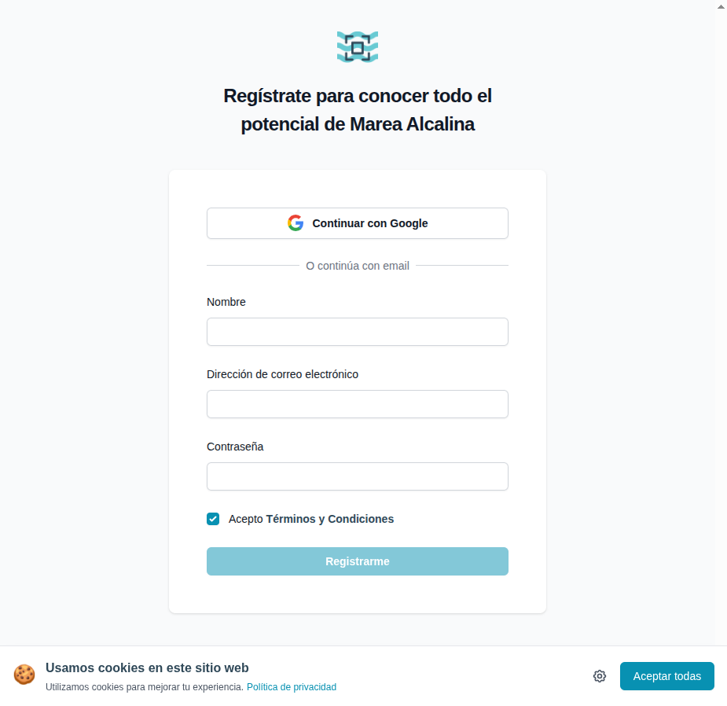

# 03 — Registro (signup)

- **URL:** `https://mareaalcalina.com/signup`
- **Momento del flujo:** creación de cuenta del comerciante.

## Acción realizada (Playwright)

1. `browser_navigate` a `/signup`.
2. `browser_evaluate` para listar inputs (name, email, password) y
   botones (Google, Registrarme).
3. `browser_take_screenshot` del formulario.

## Elementos de UI observados

- Logo + heading.
- Botón "Continuar con Google" (OAuth).
- Separador "O continúa con email".
- Formulario con: `Nombre`, `Dirección de correo electrónico`,
  `Contraseña`.
- Checkbox de términos, pre-chequeado.
- CTA "Registrarme" (disabled hasta completar campos).
- Link "¿Ya tienes cuenta? Iniciar Sesión".
- Banner de cookies inferior.

## Qué construir en el clon

- Ruta `app/(auth)/signup/page.tsx`.
- Server Action `auth.signUpWithCredentials({name, email, password})`.
- Auth.js con providers `Google` + `Credentials`.
- Envío de email de verificación con Resend.
- Validación cliente con `zod` + `react-hook-form`.
- Rate limiting por IP para evitar abuso.
- Al registrarse, crear `organizations` + `memberships` con rol `owner`.

## Autenticación con Google (observación del usuario)

- El botón Google abre OAuth estándar de Google.
- Playwright normalmente no puede completar OAuth de Google
  (anti-bot); el usuario lo completa manualmente.
- En el clon: redirect estándar de Auth.js a `/api/auth/callback/google`.
