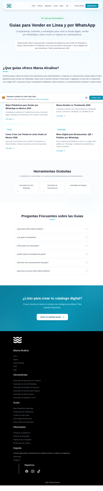

# 05 — Recursos / Guías

- **URL:** `https://mareaalcalina.com/guides`
- **Momento del flujo:** navegación en el menú Recursos.

## Acción realizada (Playwright)

1. Hover/click en botón "Recursos" del header (requirió remover overlay
   de video y usar `dispatchEvent`).
2. `browser_navigate` a `/guides`.
3. `browser_evaluate` para listar cards de guías.
4. `browser_take_screenshot` full-page.

## Elementos de UI observados

- Menú Recursos con 4 columnas:
  1. **Herramientas gratuitas** (6 tools).
  2. **Guías por industria** (30+ slugs `/como-vender/...`).
  3. **Guías y comparativas** (`/guides/...`): Comparativa, Versus,
     Tutorial, Restaurantes.
  4. **Blog** (subdominio externo).
- Página `/guides`: hero, grid de 4 cards destacadas, sección
  "Herramientas Gratuitas" con shortcuts, FAQ, CTA final, footer con
  columnas (Marea Alcalina, Herramientas, Guías, Información, Soporte,
  Síguenos).

## Qué construir en el clon

- `HeaderMegaMenu` con 4 columnas, animación slide-down.
- Ruta `app/guides/page.tsx` (índice) + `app/guides/[slug]/page.tsx`
  con MDX.
- Ruta `app/como-vender/page.tsx` + `app/como-vender/[slug]/page.tsx`.
- Esquema SEO `FAQPage`, `HowTo`, `Article`.
- Sitemap dinámico que incluya todas las guías.

## Plantillas

- **Guía/Tool template**: breadcrumb, TOC sticky, contenido MDX, FAQ,
  CTA al producto principal, cross-links a 2–3 recursos relacionados.
