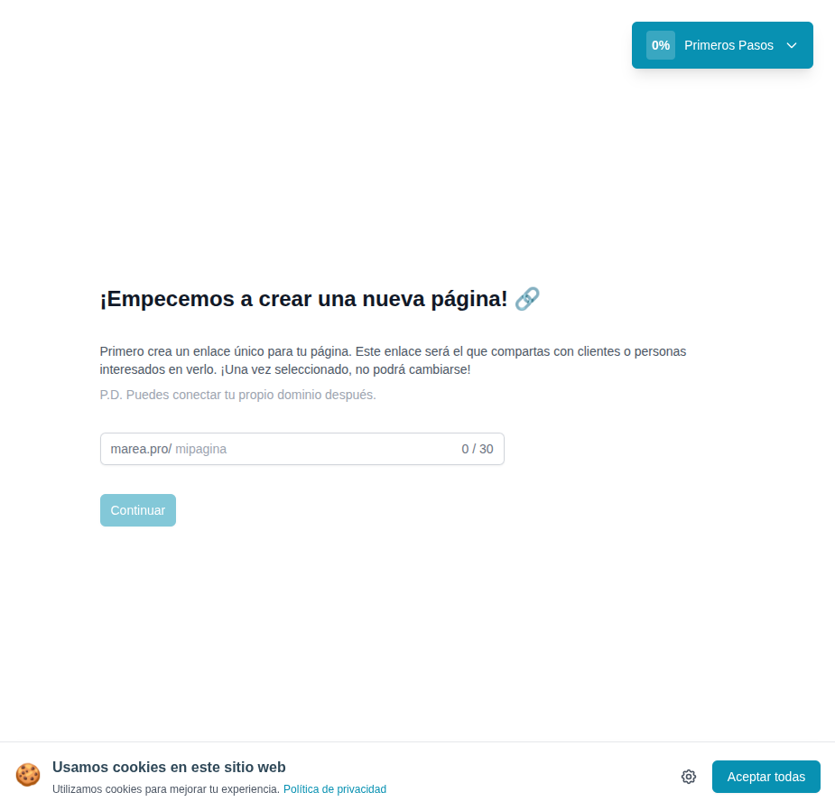

# 06 — Onboarding paso 1: elegir slug

- **URL:** `https://mareaalcalina.com/menus/create`
- **Momento del flujo:** primer paso después del signup (progreso 0%).

## Acción realizada (Playwright)

1. Tras el signup (cuenta vinculada a Google), la app redirige a
   `/menus/create`.
2. `browser_snapshot` + `browser_take_screenshot`.
3. Sin input aún; se documentó la pantalla inicial.

## Elementos de UI observados

- Heading con emoji 🔗.
- Párrafo explicativo sobre enlace único e inmutabilidad.
- Prefijo de dominio + input slug (placeholder `mipagina`), max 30
  caracteres, contador `0/30` visible.
- CTA "Continuar" deshabilitado hasta tener slug válido.
- Widget flotante "Primeros Pasos 0%" (esquina superior derecha).

## Qué construir en el clon

- Ruta `app/app/onboarding/slug/page.tsx`.
- Server Action `catalogs.createDraft({slug})`.
- Validación regex `^[a-z0-9-]{3,30}$` (sin guiones al inicio/fin).
- Verificación de unicidad contra `catalogs.slug` con debounce.
- Mensaje inline "Disponible" / "Ya está tomado".
- Persistir `catalogs.slug_locked = true` para evitar cambio posterior.

## Evento

- `onboarding.slug_selected` → actualiza progreso del usuario a 20%.
