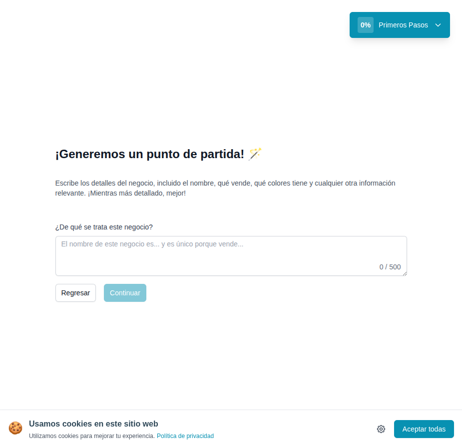

# 07 — Onboarding paso 2: descripción del negocio (prompt IA)

- **URL:** `https://mareaalcalina.com/menus/create` (step 2)
- **Momento del flujo:** después de confirmar el slug.

## Acción realizada (Playwright)

1. `browser_type` en el slug: `tienda-demo-clon`.
2. Click en `Continuar`.
3. Pantalla step 2 renderizada.
4. `browser_take_screenshot` antes de ingresar el prompt.

## Elementos de UI observados

- Heading con emoji 🪄.
- Párrafo sugiriendo incluir nombre, productos, colores, tono.
- Textarea "¿De qué se trata este negocio?" con placeholder en gris.
- Contador `0/500`.
- Botones `Regresar` y `Continuar` (este último disabled hasta tener
  texto).

## Qué construir en el clon

- Ruta `app/app/onboarding/prompt/page.tsx`.
- Textarea controlada con `react-hook-form` + zod (`min: 20`,
  `max: 500`).
- Mostrar sugerencia/ejemplo de prompt efectivo.
- Persistir en `catalogs.ai_prompt` y `catalogs.business_name`
  (extraído con regex simple o por la IA más adelante).

## Evento

- `onboarding.prompt_saved` → listo para llamar a la IA en el paso 3.
