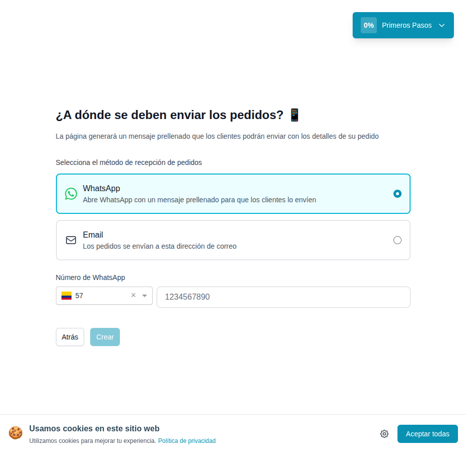

# 08 — Onboarding paso 3: método de recepción de pedidos

- **URL:** `https://mareaalcalina.com/menus/create` (step 3)
- **Momento del flujo:** después del prompt del negocio.

## Acción realizada (Playwright)

1. Textarea del paso 2 se llenó con una descripción neutra del negocio
   (negocio ficticio de comida casera con delivery).
2. Click `Continuar`.
3. Pantalla step 3 renderizada.
4. `browser_take_screenshot`.

## Elementos de UI observados

- Heading con emoji 📱.
- Párrafo explicativo sobre el mensaje prellenado.
- Dos **cards tipo radio** (selección única):
  1. WhatsApp (default, seleccionada).
  2. Email.
- Si WhatsApp: selector de país con bandera + código (`+57` Colombia
  detectado por IP) + input de teléfono.
- Si Email: input email (render condicional).
- Botones `Atrás` y `Crear` (disabled hasta teléfono válido).

## Qué construir en el clon

- Ruta `app/app/onboarding/channel/page.tsx`.
- Componente `RadioCard` (icono + título + descripción).
- Selector de país con `libphonenumber-js` + bandera SVG.
- Validación E.164 del teléfono antes de habilitar CTA.
- Persistir `order_channel`, `contact_phone`, `contact_country`,
  `contact_email`.

## Evento

- `onboarding.channel_configured` → dispara paso 4 (generación IA).
