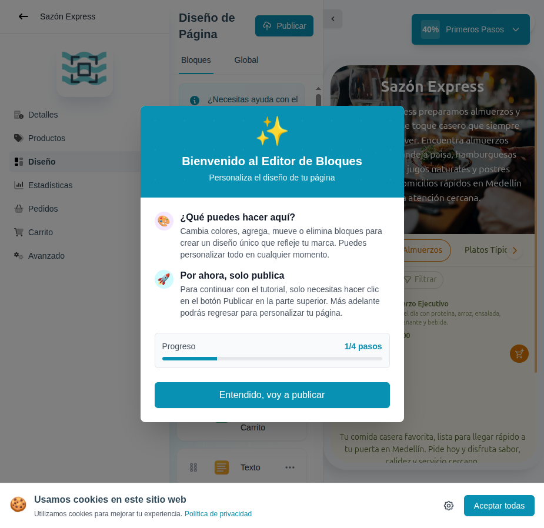

# 09 — Onboarding paso 4: generación automática con IA



- **URL:** `https://mareaalcalina.com/menus/create` (loading) → redirect
  a `/menus/block-editor?menuId=:id&onboarding=new`
- **Momento del flujo:** tras hacer click en `Crear`.

## Acción realizada (Playwright)

1. Ingreso de `3001234567` en el input de teléfono WhatsApp.
2. Click `Crear`.
3. Se observó overlay a pantalla completa con loader AI.
4. `browser_take_screenshot` al momento del loader.
5. La app redirigió al editor de bloques con catálogo generado.

## Elementos de UI observados

- Overlay de loading con avatar "AI".
- Mensaje: "Guardando todo lo necesario y construyendo la estructura de
  tu página" (con emoji 🌊).
- Cambio de URL al editor de bloques con parámetros de onboarding.

## Qué construir en el clon

- Server Action `ai.generateCatalog({ prompt, locale, currency })`.
- Usar Claude con **tool use** para forzar salida JSON validada por
  `zod`:
  ```ts
  {
    business_name, tagline, description,
    categories: [{name, emoji}],
    products: [{name, description, price, category, image_prompt}],
    color_scheme: {primary, secondary, accent},
    blocks: [{type, config}]
  }
  ```
- Persistir en transacción: `catalogs`, `categories`, `products`,
  `blocks`.
- Activar **prompt caching** (Anthropic) para el system prompt largo.
- Timeout 30s; si falla → plantilla fallback predefinida.
- Generar imágenes placeholder (Unsplash/Pexels con query por producto)
  mientras el comerciante las reemplaza.
- Emitir `onboarding.ai_generated`.

## Notas

- Esta es la feature clave diferenciadora; costosa, gating por plan en
  producción.
