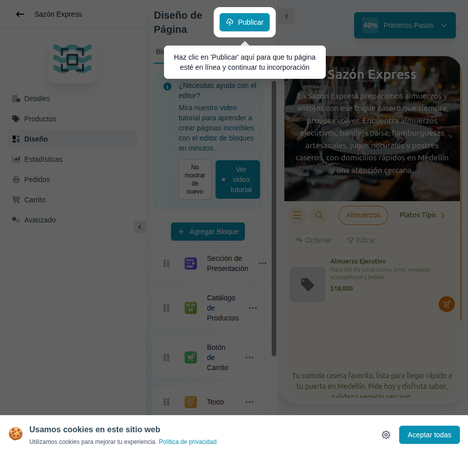

# 10 — Editor de bloques (primera vista)

- **URL:** `https://mareaalcalina.com/menus/block-editor?menuId=:id&onboarding=new`
- **Momento del flujo:** entrada al editor con catálogo recién generado
  por la IA. Progreso 40% (1/4 pasos del tour).

## Acción realizada (Playwright)

1. Redirección automática tras la generación IA.
2. `browser_take_screenshot` con el modal de bienvenida activo.
3. `browser_snapshot` para extraer estructura.

## Elementos de UI observados

- **Sidebar izquierdo** con módulos del catálogo: Detalles · Productos ·
  Diseño (activo) · Estadísticas · Pedidos · Carrito · Avanzado.
  (Post-publicación aparecen también Pagos y Checkout.)
- **Panel central** "Diseño de Página" con tabs `Bloques` / `Global`.
  - Banner de ayuda con video tutorial.
  - Lista de bloques con drag handle y menú opciones: Sección de
    Presentación · Catálogo de Productos · Botón de Carrito · Texto.
  - Botón "Agregar Bloque".
- **Panel derecho**: preview del storefront en iframe (en vivo).
- **Header**: botón "Publicar" (teal) + avatar del usuario.
- **Modal de bienvenida** con confeti y progreso "1/4 pasos" y CTA
  "Entendido, voy a publicar".
- **Spotlight overlay** que apunta al botón Publicar.

## Qué construir en el clon

- Ruta `app/app/catalogs/[id]/design/page.tsx`.
- Layout 3 columnas (sidebar, block list, preview iframe).
- Block registry: `blocks/types/{Hero,ProductList,CartButton,Text,...}`.
- Drag & drop con `dnd-kit`.
- Autosave por bloque (`blocks.config_json`).
- Preview en iframe con `postMessage` para hot-reload.
- Tour guiado con `driver.js` o custom.
- Modal de onboarding con step tracker (1/4 pasos).

## Modelo de datos

- `blocks` (id, catalog_id, type, position, config_json, visible).
- `block_versions` para historial/undo opcional.
