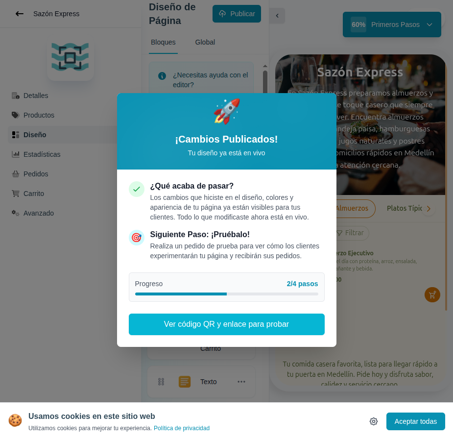

# 11 — Confirmación de publicación

- **URL:** misma del editor, tras disparar acción de publicar.
- **Momento del flujo:** progreso avanza a 60% (2/4 pasos).

## Acción realizada (Playwright)

1. Click en "Entendido, voy a publicar" para cerrar el modal del tour.
2. `browser_evaluate` para remover el spotlight overlay (interceptaba
   eventos pointer) y click programático en el botón `Publicar`.
3. Se mostró modal "¡Cambios Publicados!".
4. `browser_take_screenshot`.

## Elementos de UI observados

- Modal con ilustración de cohete 🚀.
- Título "¡Cambios Publicados! Tu diseño ya está en vivo".
- Checklist:
  - ✓ ¿Qué acaba de pasar? — diseño ya visible a clientes.
  - 🎯 Siguiente paso: probarlo (pedido de prueba).
- Barra de progreso "2/4 pasos".
- CTA grande "Ver código QR y enlace para probar".

## Qué construir en el clon

- Server Action `catalogs.publish(id)` que:
  - Marca `published_at`.
  - Invalida ISR del storefront (`revalidateTag('catalog:'+slug)`).
  - Regenera sitemap.
  - Emite `catalog.published`.
- Modal de éxito con animación (lottie/cohete).
- CTA que navega a la pantalla de share (`/app/catalogs/[id]` detalles).

## Notas

- La acción debe ser **idempotente**: republicar no duplica registros.
- Si el catálogo estaba ya publicado, el copy cambia a "Cambios
  aplicados".
