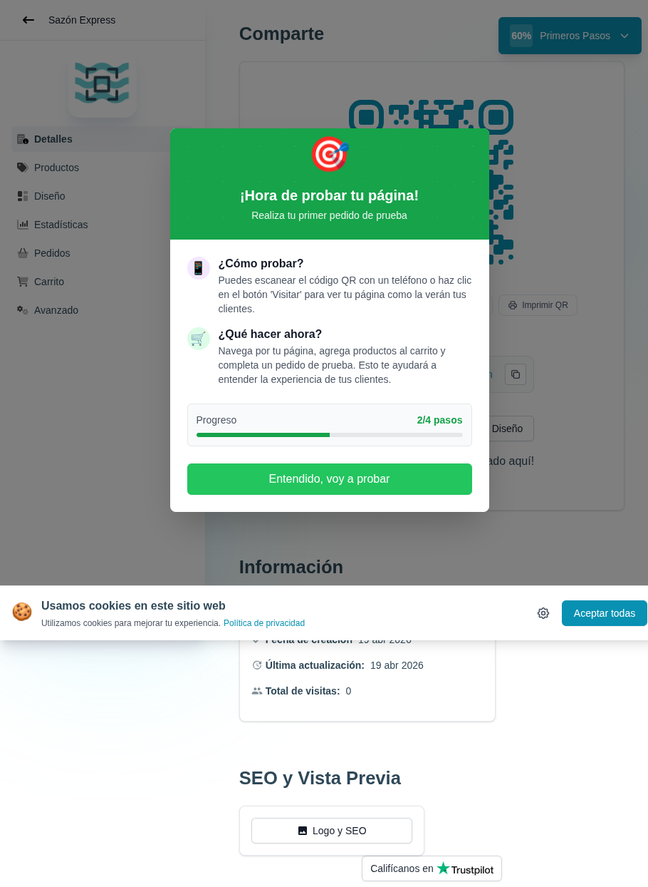

# 12 — Pantalla de compartir (QR + URL)

- **URL:** `https://mareaalcalina.com/menus/menu-detail?menuId=:id&onboarding=new&id=:id`
- **Momento del flujo:** llegada al módulo Detalles tras publicar.

## Acción realizada (Playwright)

1. Click en CTA "Ver código QR y enlace para probar" del modal previo.
2. `browser_take_screenshot` full-page.
3. Sobre esta pantalla aparece un segundo modal "¡Hora de probar tu
   página!" (2/4 pasos) con CTA "Entendido, voy a probar".

## Elementos de UI observados

- Sidebar con `Detalles` activo.
- Panel "Comparte": QR autogenerado del enlace público.
- Botón "Imprimir QR".
- Secundario: "Información" (fecha creación, última actualización,
  total visitas).
- Modal secundario "¡Hora de probar tu página!" con explicación y CTA.

## Qué construir en el clon

- Ruta `app/app/catalogs/[id]/page.tsx` (Detalles).
- Componente `ShareQR`: genera QR con lib `qrcode` server-side +
  download PNG/SVG.
- Componente `PrintQR`: plantilla A5 imprimible con logo y slogan.
- Panel `Info`: fechas, visitas (desde `analytics_events`).
- Modal de coach "Hora de probar" con progreso `2/4`.

## Notas

- Contador `total_visits` se calcula desde `analytics_events` con
  agregación por catálogo.
