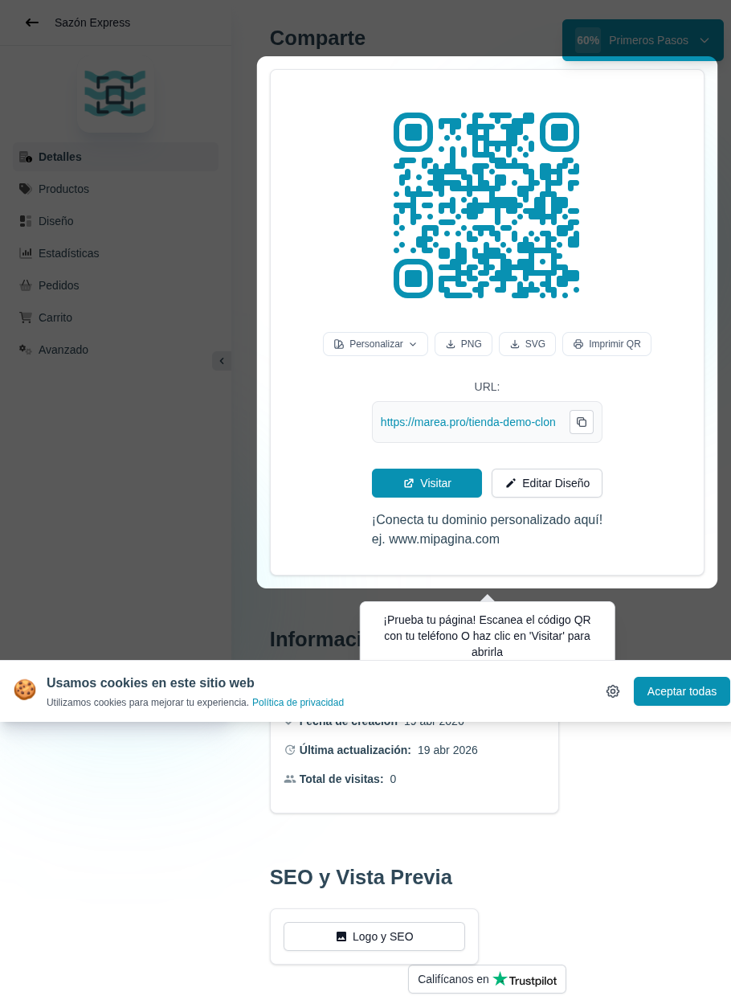

# 13 — Panel de compartir completo

- **URL:** `/menus/menu-detail?menuId=:id&onboarding=new`
- **Momento del flujo:** misma pantalla de Detalles con el modal de
  coaching ya cerrado.

## Acción realizada (Playwright)

1. Click en "Entendido, voy a probar" del modal.
2. `browser_take_screenshot` full-page para capturar el panel completo.

## Elementos de UI observados

- Panel "Comparte" con QR grande.
- Barra de acciones: `Personalizar` (dropdown color/logo) ·
  `PNG` · `SVG` · `Imprimir QR`.
- Campo URL del storefront con botón copiar al portapapeles.
- CTAs "Visitar" (abre tienda) y "Editar Diseño" (editor).
- Hint para conectar dominio personalizado (ej. `www.mipagina.com`).
- Panel "Información" y "SEO y Vista Previa".

## Qué construir en el clon

- Componente `ShareQRPanel` con:
  - `QRPreview` + opciones de personalización (color, logo central,
    margen).
  - Export PNG/SVG/PDF via server action.
  - Botón `Copiar URL` con feedback toast.
  - Link `Visitar` → abre nueva pestaña con storefront.
  - Link `Editar Diseño` → `/app/catalogs/[id]/design`.
- Componente `CustomDomainCard` con validador CNAME y guía de conexión.

## Seguridad

- QR y enlace deben invalidarse si el catálogo se despublica.
- El panel "Personalizar" puede estar gated a planes Pro+.
