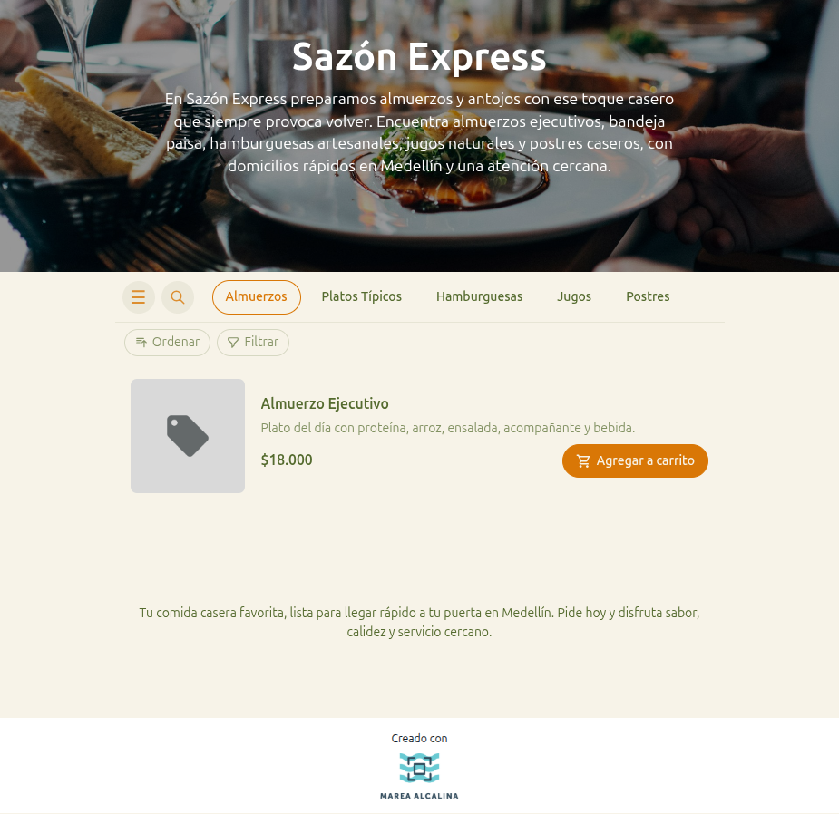

# 14 — Storefront público (vitrina del cliente)

- **URL:** `https://marea.pro/tienda-demo-clon`
- **Momento del flujo:** primera visita del cliente al catálogo
  publicado (simulada por el comerciante como prueba).

## Acción realizada (Playwright)

1. Click en "Visitar" → `browser_navigate` a la URL pública.
2. `browser_take_screenshot` full-page.
3. `browser_snapshot` para mapear nav, categorías y productos.

## Elementos de UI observados

- Hero full-width con imagen de fondo + nombre del negocio +
  descripción (autogenerada por la IA).
- Barra de categorías chips (horizontal scroll) con ícono `☰` (abrir
  menú completo) y `🔍` (buscar).
- Toolbar `Ordenar` / `Filtrar`.
- Cards de producto con miniatura, nombre, descripción, precio y botón
  "Agregar a carrito".
- Mensaje cierre + footer "Creado con …" (branding del SaaS, ocultable
  en Pro+).

## Qué construir en el clon

- Ruta `app/s/[slug]/page.tsx` (RSC con ISR por catálogo).
- Componentes `StorefrontHero`, `CategoryChips`, `ProductGrid`,
  `ProductCard`, `StorefrontFooter`.
- Estado del carrito persistido en `localStorage` + cookie
  `cart_token` (sesión de invitado).
- Filtros controlados por query string (`?sort=price&cat=...`).
- Componente `BrandMark` reemplazable por el logo del comerciante
  (planes pagos) o del SaaS (plan Gratis).

## Datos

- SSR fetchs: `getCatalogBySlug(slug)`, `listCategories(catalog_id)`,
  `listProducts(catalog_id, filters)`.
- Cache tag: `catalog:${slug}` para invalidación granular.
