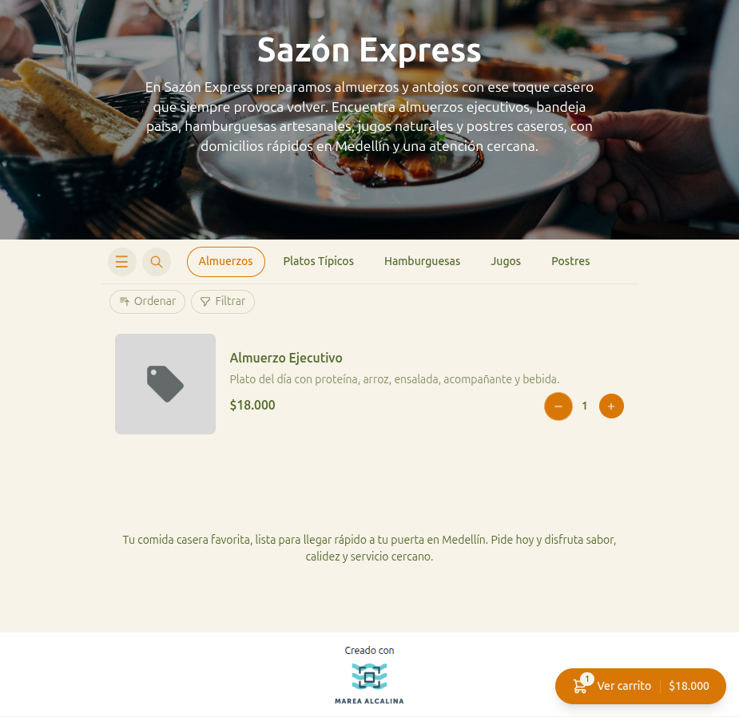

# 15 — Producto agregado al carrito

- **URL:** `https://marea.pro/tienda-demo-clon`
- **Momento del flujo:** cliente agrega primer producto al carrito.

## Acción realizada (Playwright)

1. Click en "Agregar a carrito" del primer producto.
2. `browser_take_screenshot` full-page.

## Elementos de UI observados

- El botón "Agregar a carrito" se transforma en **stepper**
  (`- 1 +`) para ajustar cantidad inline.
- Aparece barra flotante inferior pegada al viewport con:
  - Contador de items (badge).
  - Texto "Ver carrito".
  - Subtotal del carrito.
- El resto de la vitrina permanece visible.

## Qué construir en el clon

- Estado global del carrito (Zustand o React Context) con:
  - `addItem(productId, qty, variantId?)`
  - `incrementItem(productId)` / `decrementItem(productId)`
  - `removeItem(productId)`
  - Selector `cartSubtotal()`.
- Componente `QuantityStepper` que reemplaza al botón añadir al
  seleccionar cantidad > 0.
- Componente `CartFab` (barra inferior sticky) con transición suave
  al primer add.
- Persistencia en `localStorage` con clave `cart:${slug}`.
