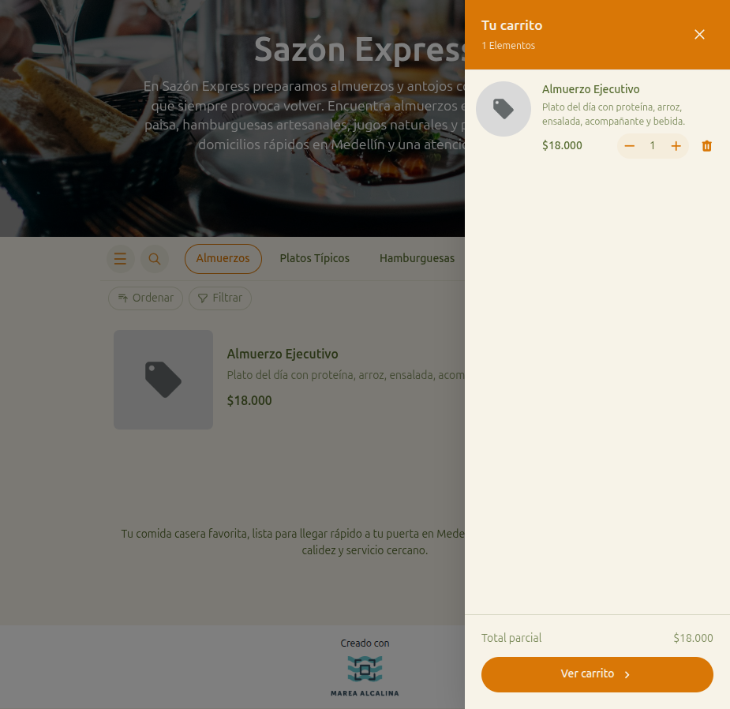

# 16 — Mini-carrito (drawer lateral)

- **URL:** `https://marea.pro/tienda-demo-clon` (overlay)
- **Momento del flujo:** click en "Ver carrito" desde la barra sticky.

## Acción realizada (Playwright)

1. Click en barra sticky "Ver carrito".
2. `browser_take_screenshot` con drawer abierto.

## Elementos de UI observados

- Drawer lateral derecho con animación slide-in.
- Header "Tu carrito · N Elementos" + botón cerrar (×).
- Lista de items con miniatura, nombre, descripción corta, precio,
  stepper `- qty +`, botón eliminar (basura).
- Footer con "Total parcial" y CTA "Ver carrito ›".
- Backdrop semitransparente; click afuera cierra el drawer.

## Qué construir en el clon

- Componente `CartDrawer` (shadcn `Sheet` o Radix Dialog).
- Reusa `QuantityStepper` y `CartItem`.
- CTA navega a `/s/[slug]/cart` (vista completa).
- Accesibilidad: focus trap + `aria-labelledby`.
- En mobile, ocupa 100% ancho.
