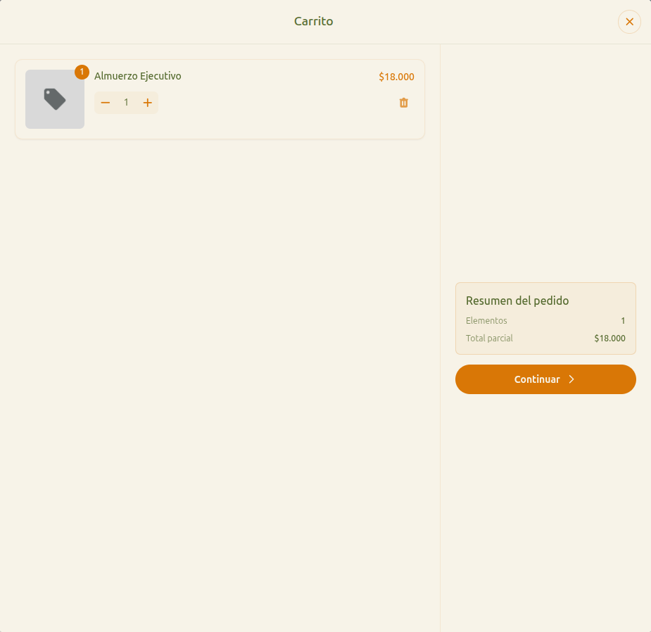

# 17 — Carrito (vista completa)

- **URL:** `https://marea.pro/tienda-demo-clon?step=products`
- **Momento del flujo:** vista pantalla completa del carrito, paso 1
  del checkout.

## Acción realizada (Playwright)

1. Click en CTA "Ver carrito" del drawer.
2. `browser_take_screenshot` full-page.

## Elementos de UI observados

- Header "Carrito" con botón cerrar (×) → vuelve a la vitrina.
- Panel izquierdo: lista de items editables (stepper + eliminar).
- Panel derecho (columna pegada en desktop): **Resumen del pedido**
  con Elementos y Total parcial, CTA "Continuar ›".
- Sin selector de entrega ni datos aún; solo revisar items.

## Qué construir en el clon

- Ruta `app/s/[slug]/cart/page.tsx`.
- Usar query string `?step=products` para paso activo del checkout
  (Wizard state machine con `zustand` o URL-driven).
- Validar carrito no vacío antes de habilitar CTA.
- Al continuar, navegar a `?step=delivery`.

## Estado del wizard

Secuencia: `products` → `delivery` → `customer-data` → `summary` →
`confirm`.
