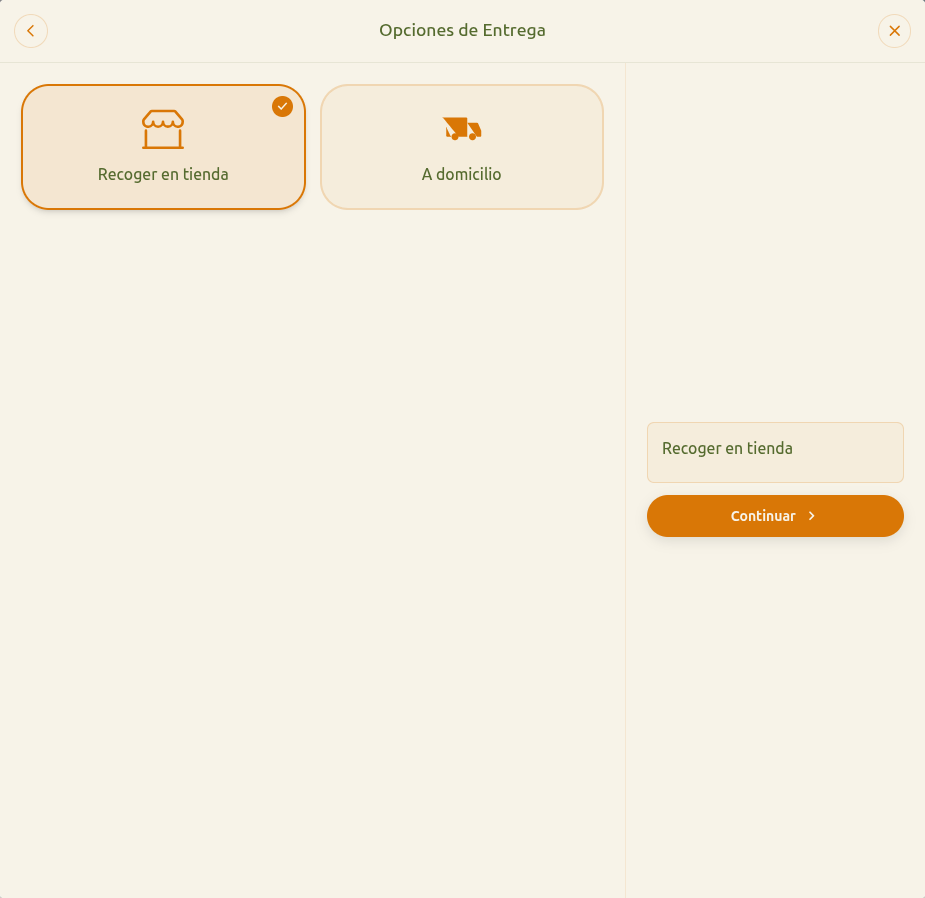

# 18 — Checkout: opciones de entrega

- **URL:** `https://marea.pro/tienda-demo-clon?step=delivery`
- **Momento del flujo:** paso 2 del checkout.

## Acción realizada (Playwright)

1. Click en "Continuar" desde la vista de carrito.
2. `browser_take_screenshot` full-page.

## Elementos de UI observados

- Header "Opciones de Entrega" con volver y cerrar.
- Dos cards grandes tipo radio:
  1. **Recoger en tienda** (default, seleccionada ✓).
  2. **A domicilio**.
- Panel derecho resumen con la selección + CTA "Continuar ›".
- Si se elige "A domicilio", el panel pediría dirección, zona,
  indicaciones (no se exploró por defecto).

## Qué construir en el clon

- Ruta `app/s/[slug]/checkout/delivery/page.tsx`.
- Componente `DeliveryTypeSelector` con dos cards radio.
- Renderizado condicional: al elegir "A domicilio":
  - Input `address` + botón autocompletado (Google Places opcional).
  - Selector `zone` (de catálogo: `delivery_zones`).
  - Textarea `notes`.
  - Cálculo de `shipping_fee` según zona.
- Persistir en estado del carrito: `delivery: { type, address?, zone?,
  fee? }`.

## Modelo de datos

- `delivery_zones` (catalog_id, name, polygon_json|city, base_fee,
  min_order, eta_minutes).
