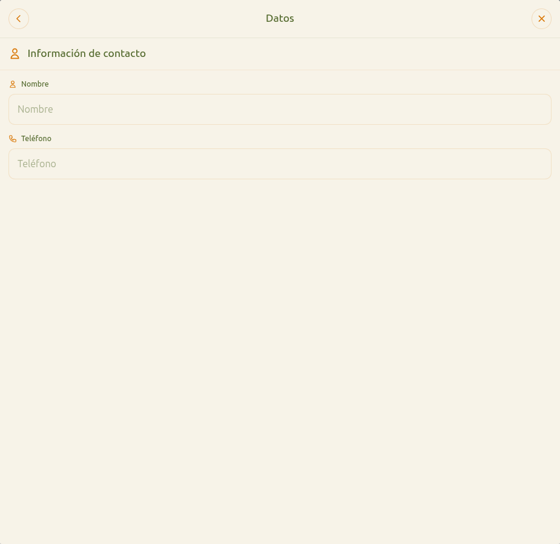

# 19 — Checkout: datos del cliente

- **URL:** `https://marea.pro/tienda-demo-clon?step=customer-data`
- **Momento del flujo:** paso 3 del checkout.

## Acción realizada (Playwright)

1. Click "Continuar" tras elegir recoger en tienda.
2. `browser_take_screenshot` full-page.

## Elementos de UI observados

- Header "Datos" con volver y cerrar.
- Sección "Información de contacto" con íconos.
- Inputs: `Nombre`, `Teléfono`.
- Estado vacío (sin panel lateral resumen hasta llenar datos).

## Qué construir en el clon

- Ruta `app/s/[slug]/checkout/contact/page.tsx`.
- Formulario con `react-hook-form` + `zod`:
  - `name` (min 2, max 80).
  - `phone` con validación E.164 usando país del catálogo.
  - `email` (si canal del comerciante es email o si plan lo exige).
  - `doc_id` (opcional según país, ej. NIT/CC en Colombia, RFC en MX).
- Persistir en estado `customer`.
- Habilitar CTA al pasar validación.

## Privacidad

- No almacenar el `phone` en `analytics_events` crudo; hashear con
  `sha256(phone + salt)` para métricas anónimas.
