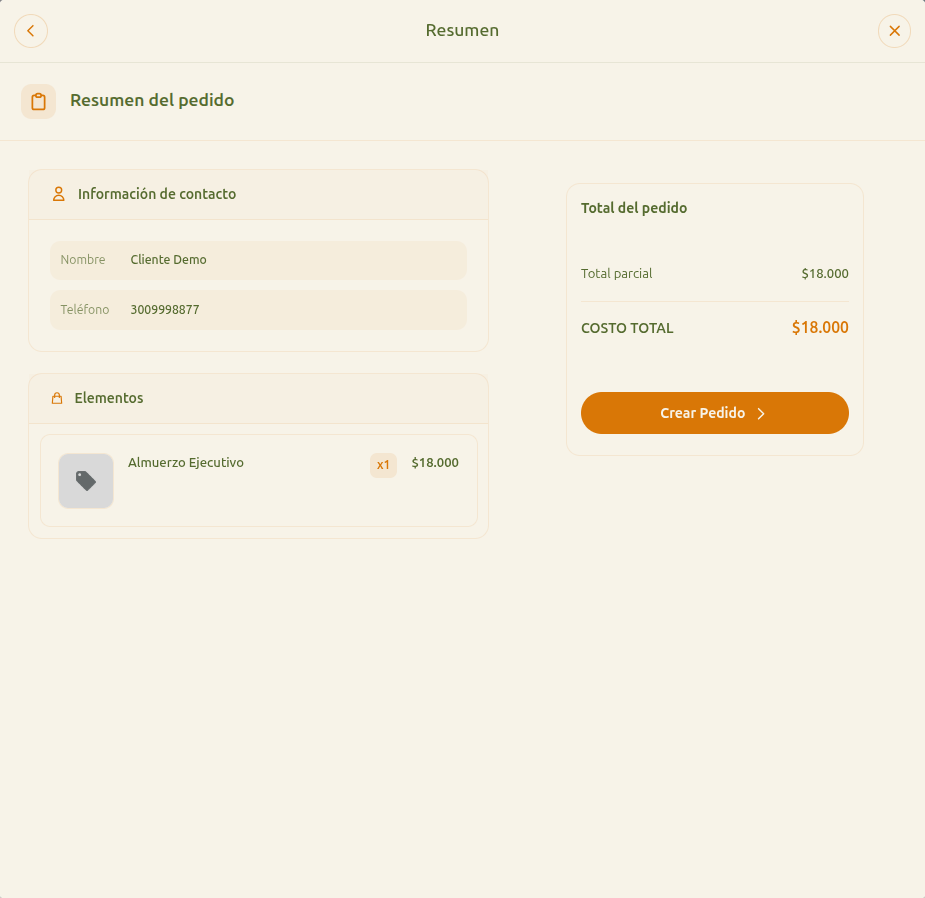

# 20 — Checkout: resumen final

- **URL:** `https://marea.pro/tienda-demo-clon?step=summary`
- **Momento del flujo:** paso 4 del checkout, última revisión antes de
  crear el pedido.

## Acción realizada (Playwright)

1. `browser_type` en `Nombre` → valor genérico.
2. `browser_type` en `Teléfono` → valor genérico.
3. Click "Continuar".
4. `browser_take_screenshot` full-page.

## Elementos de UI observados

- Header "Resumen" con volver y cerrar.
- Título de sección "Resumen del pedido".
- Card "Información de contacto" con nombre y teléfono.
- Card "Elementos" con lista de productos, cantidad y subtotal.
- Panel derecho "Total del pedido": Total parcial + **COSTO TOTAL**
  destacado y CTA "Crear Pedido ›".

## Qué construir en el clon

- Ruta `app/s/[slug]/checkout/summary/page.tsx`.
- Componente `OrderSummaryPanel` que consume el estado del wizard.
- Cálculos en `lib/cart/totals.ts`: subtotal, descuentos, envío, total.
- Formatter de moneda según `catalog.currency` + locale.
- CTA "Crear Pedido" dispara Server Action `orders.create(payload)` y
  redirige a `?step=confirm`.

## Validaciones server-side

- Recalcular precios desde DB (no confiar en cliente).
- Verificar stock disponible (reservar o bloquear).
- Generar `code` único (`YYYYMMDD###` por catálogo, secuencia diaria).
