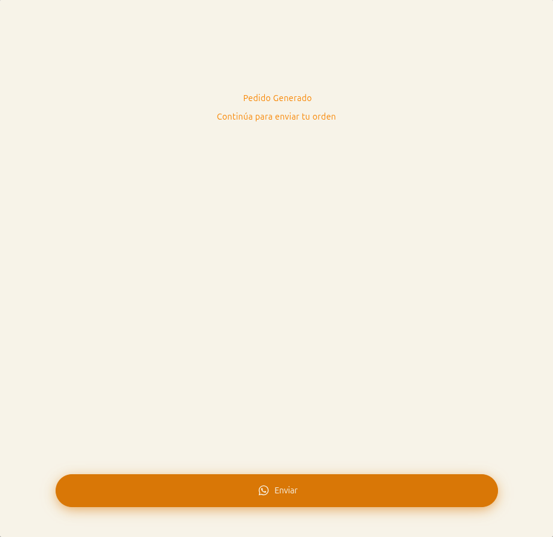

# 21 — Pedido generado + envío a WhatsApp

- **URL:** `https://marea.pro/tienda-demo-clon?step=summary` (UI final)
- **Momento del flujo:** pedido persistido, listo para enviarse al
  comerciante.

## Acción realizada (Playwright)

1. Click en "Crear Pedido".
2. `browser_take_screenshot` con la nueva pantalla.
3. `browser_evaluate` interceptando `window.open` para capturar la URL
   de WhatsApp que se abriría sin abrir realmente el navegador.
4. La URL capturada apunta a `api.whatsapp.com/send?phone=...&text=...`
   con el mensaje pre-rellenado.

## Elementos de UI observados

- Pantalla minimalista con texto "Pedido Generado" y subtítulo
  "Continúa para enviar tu orden".
- Botón sticky inferior grande con ícono WhatsApp: `Enviar`.

## Plantilla del mensaje (variables a replicar)

El mensaje incluye:

- Saludo + URL del storefront.
- Número de pedido (formato `YYYYMMDD###`).
- Fecha y hora de emisión.
- Bloque "Información del cliente": nombre y teléfono.
- Línea de entrega según tipo (pickup o dirección).
- Lista de items: `xN Nombre   $ precio CURRENCY`.
- Bloque costos: subtotal, envío/descuento si aplica, costo total.
- Instrucción final invitando a enviar el mensaje.

Ver `architecture.md §10.B Paso 8.7` para la plantilla exacta del
generador `buildWhatsAppOrderMessage()`.

## Qué construir en el clon

- Ruta `app/s/[slug]/checkout/confirm/page.tsx`.
- Al entrar:
  - Persistir `orders` con `status='pending_send'` (si no se hizo en
    step summary).
  - Construir URL `https://api.whatsapp.com/send?...` con
    `encodeURIComponent` del mensaje.
- Botón `Enviar`:
  - Abre la URL en nueva pestaña (`target="_blank"`).
  - Emite `order.sent_whatsapp` y actualiza `whatsapp_sent_at`.
  - Redirige a `/s/[slug]/order/[code]` con página de gracias.
- Si el canal es email: enviar via Resend y mostrar "Pedido enviado
  por email".

## Variables de la URL

- `phone`: `catalog.contact_country + catalog.contact_phone` (E.164
  sin `+`).
- `text`: cuerpo completo escapado.
