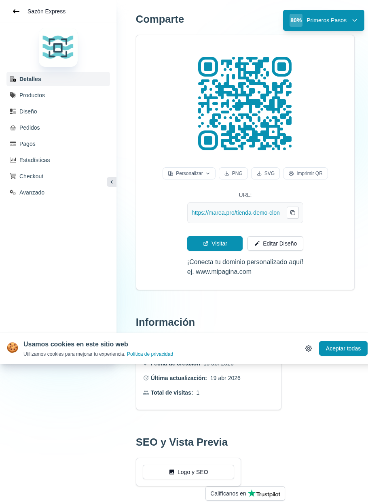

# 22 — Dashboard tras el primer pedido

- **URL:** `/menus/menu-detail?menuId=:id&onboarding=new&id=:id`
- **Momento del flujo:** regreso al panel del comerciante tras enviar
  el pedido de prueba. Progreso sube a **80%**.

## Acción realizada (Playwright)

1. `browser_navigate` de vuelta al panel del catálogo.
2. `browser_take_screenshot` full-page.

## Elementos de UI observados

- Sidebar ahora incluye módulos adicionales: `Pagos` y `Checkout`
  (aparecen al avanzar el onboarding).
- Panel "Comparte" (QR + URL) igual a capturas 12/13.
- Panel "Información": `Total de visitas: 1` (tracking activo).
- Badge "Primeros Pasos 80%" arriba derecha.

## Qué construir en el clon

- Sidebar dinámico:
  - Items siempre visibles: Detalles, Productos, Diseño, Pedidos,
    Estadísticas, Avanzado.
  - Items que aparecen según avance:
    - `Pagos` → tras configurar canal de pedidos.
    - `Checkout` → tras publicar el catálogo.
- Tracking de visitas server-side desde el storefront (middleware que
  registra `analytics_events.type='page_view'`).

## Observación

- El contador de visitas `1` viene de la visita previa del comerciante
  a su propia URL pública. No filtra IPs internas; en el clon podemos
  excluir IPs del owner y hacer doble registro separado.
