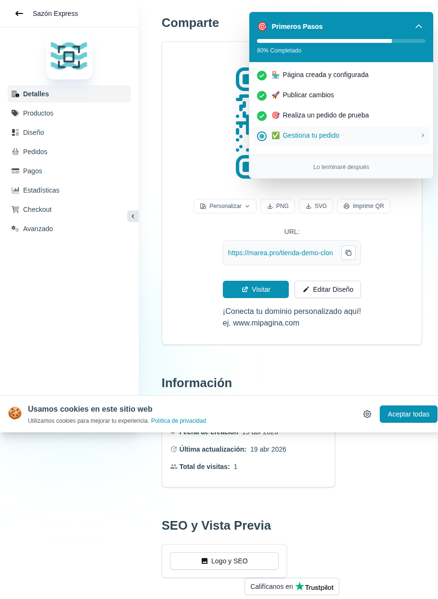

# 25 — Widget "Primeros Pasos" (expandido, 80%)



- **URL:** `/menus/menu-detail?menuId=:id`
- **Momento del flujo:** panel flotante desplegado mostrando los 4
  pasos del onboarding.

## Acción realizada (Playwright)

1. Se despacharon eventos pointer (`pointerdown`, `mousedown`, `click`)
   sobre el widget.
2. El panel se expandió mostrando el checklist.
3. `browser_take_screenshot` full-page.

## Elementos de UI observados

- Cabecera del panel con logo/ícono y título "Primeros Pasos" + chevron
  invertido para colapsar.
- Barra de progreso horizontal con "80% Completado".
- Checklist de 4 pasos:
  1. ✓ Página creada y configurada (con emoji 🏗).
  2. ✓ Publicar cambios (con emoji 🚀).
  3. ✓ Realiza un pedido de prueba (con emoji 🎯).
  4. ◻ Gestiona tu pedido (paso activo, con CTA → a la derecha).
- Botón "Lo terminaré después" al pie.

## Qué construir en el clon

- Componente `OnboardingChecklistPanel` con 4 `OnboardingStep`:
  - Estructura `{ id, label, icon, completed, cta_href }`.
  - Tildes animados al completarse.
  - Click en paso no completado → navega a la ruta correspondiente.
- Seed de pasos en `lib/onboarding/steps.ts`:
  ```ts
  [
    { id: 'create_catalog', cta: '/app/onboarding/slug' },
    { id: 'publish', cta: '/app/catalogs/:id/design' },
    { id: 'test_order', cta: 'https://<url>/:slug' },
    { id: 'manage_order', cta: '/app/catalogs/:id/orders' }
  ]
  ```
- Persistir progreso en `user_onboarding_progress` y reflejar con
  Supabase Realtime o revalidación.
- Botón "Lo terminaré después" oculta temporalmente el widget (guarda
  flag de sesión).
