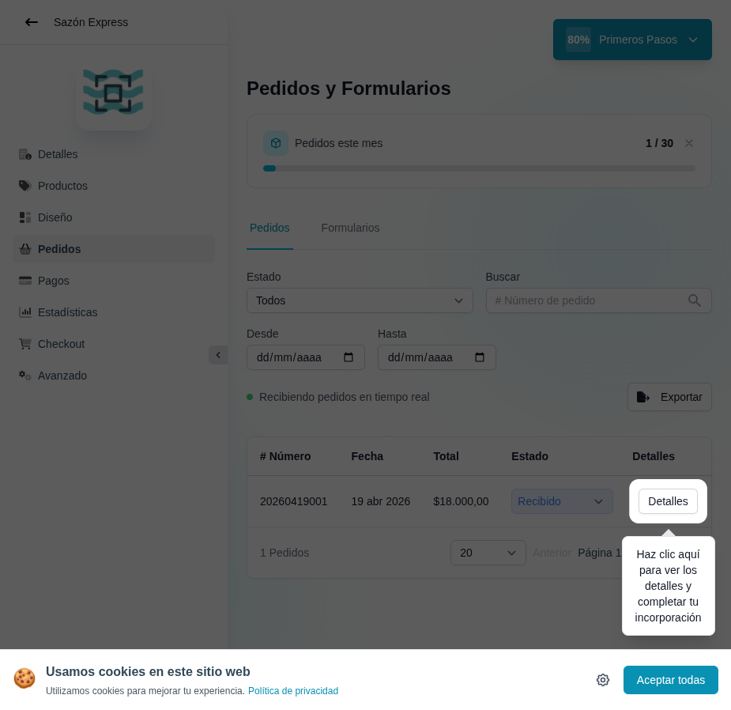

# 26 — Bandeja de pedidos (dashboard)

- **URL:** `/menus/orders/orders?id=:id`
- **Momento del flujo:** al clickear "Gestiona tu pedido" del paso 4.

## Acción realizada (Playwright)

1. `browser_evaluate` para hacer click en el ítem "Gestiona tu pedido"
   del checklist.
2. Redirección a la bandeja de pedidos.
3. `browser_take_screenshot` full-page.

## Elementos de UI observados

- Encabezado "Pedidos y Formularios" con tabs: `Pedidos` /
  `Formularios`.
- Card de cuota: "Pedidos este mes · 1 / 30" con barra de progreso
  según plan.
- Filtros:
  - Select `Estado` (Todos).
  - Input `Buscar` por # pedido.
  - Rango `Desde` / `Hasta` (date pickers).
- Badge verde pulsante "Recibiendo pedidos en tiempo real" (indica
  conexión websocket/SSE).
- Botón `Exportar` (CSV/XLSX).
- Tabla con columnas: # Número, Fecha, Total, Estado (combo editable
  inline), Detalles (botón).
- Paginación: `1 Pedidos`, selector 20/pg, navegación anterior/próximo.
- Tooltip/spotlight sobre "Detalles" diciendo "Haz clic aquí para ver
  los detalles y completar tu incorporación".

## Qué construir en el clon

- Ruta `app/app/catalogs/[id]/orders/page.tsx`.
- Server Component con paginación por URL (`?page=`, `?status=`).
- Componente `OrdersTable` con columnas ordenables.
- `OrdersRealtimeBadge` con Supabase Realtime subscribed a `orders`
  filtered by `catalog_id`.
- `ExportOrdersButton` con Server Action que genera CSV/XLSX y stream
  al cliente.
- Gating de cuota: si plan limita pedidos/mes, mostrar banner upgrade.
- Combo de estado: al cambiar, Server Action `orders.updateStatus` con
  optimistic UI.

## Modelo de datos

- `orders.status` enum (`received`, `preparing`, `ready`, `delivered`,
  `cancelled`).
- Index por `(catalog_id, created_at desc, status)`.
