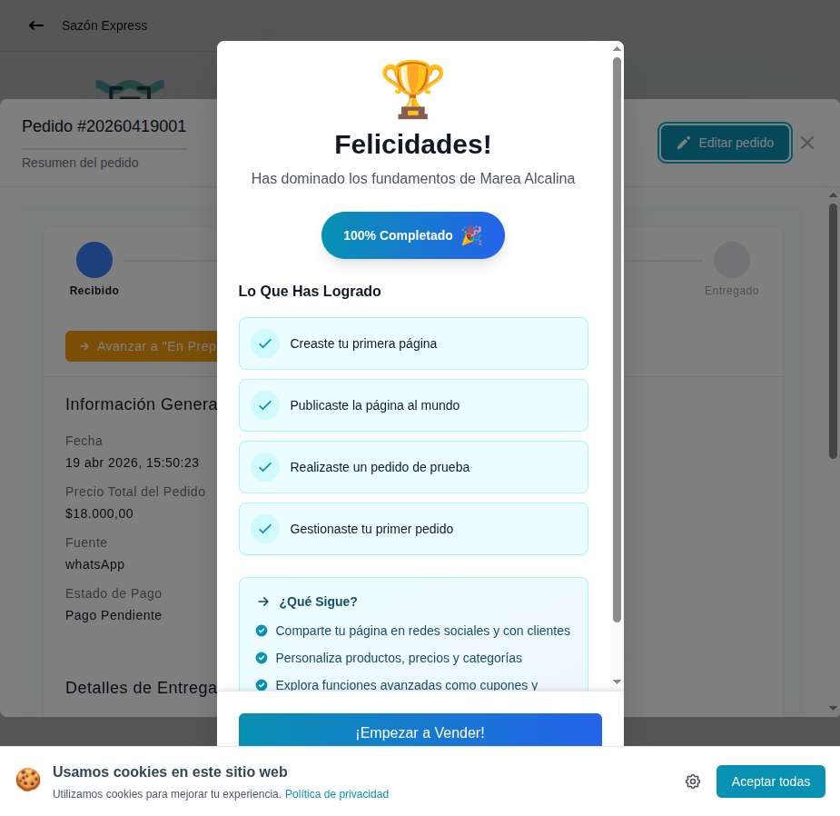

# 27 — Detalle de pedido + modal "100% Completado"



- **URL:** `/menus/orders/orders?id=:id&orderId=:orderId`
- **Momento del flujo:** al abrir el detalle del pedido, la app dispara
  un modal de celebración por completar el onboarding.

## Acción realizada (Playwright)

1. `browser_evaluate` para remover el spotlight overlay que bloqueaba
   clicks.
2. Click programático en el botón "Detalles" de la fila.
3. Modal de celebración renderizado automáticamente.
4. `browser_take_screenshot` full-page.

## Elementos de UI observados

- Detalle del pedido al fondo (stepper de estados, info del cliente,
  productos, totales).
- Modal centrado "Felicidades" con:
  - Ilustración de trofeo 🏆.
  - Subtítulo "Has dominado los fundamentos".
  - Badge gradient "100% Completado 🎉".
  - Lista "Lo Que Has Logrado" con 4 tildes verdes.
  - Bloque "¿Qué Sigue?" con 3 sugerencias:
    - Compartir en redes sociales.
    - Personalizar productos/precios/categorías.
    - Explorar funciones avanzadas (cupones, etc.).
  - CTA principal gradient "¡Empezar a Vender!".

## Qué construir en el clon

- Componente `OnboardingCompleteModal` disparado por el efecto:
  ```ts
  useEffect(() => {
    if (onboardingProgress === 100 && !onboardingCelebrationSeen) {
      setShowModal(true);
      markCelebrationSeen();
    }
  }, [onboardingProgress]);
  ```
- Animación: `framer-motion` con scale + confetti (lib
  `canvas-confetti`).
- CTA cierra modal y navega a `/app/catalogs/[id]/design`.
- Persistir flag `onboarding_celebration_seen_at` en `users`.

## Nota

- No mostrar más de una vez por usuario.
- Si el usuario ya completó algún paso antes de la nueva instalación,
  no disparar retroactivo.
