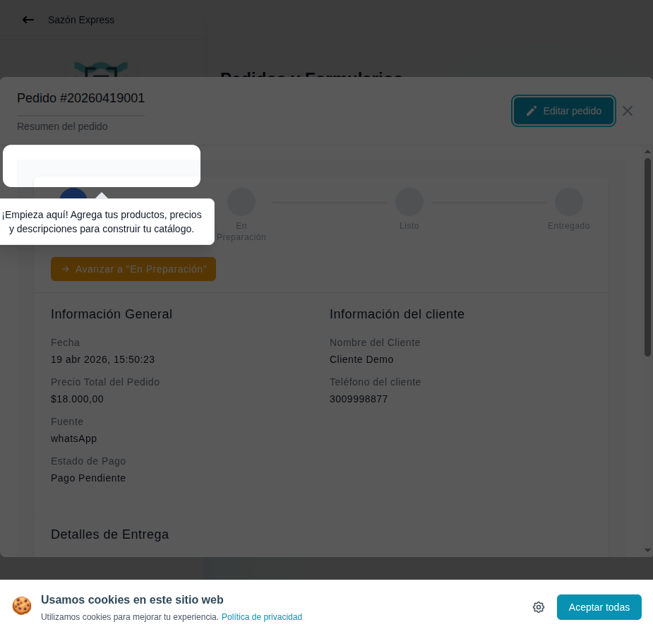

# 28 — Detalle de pedido (parte superior)

- **URL:** `/menus/orders/orders?id=:id&orderId=:orderId`
- **Momento del flujo:** tras cerrar el modal de celebración, panel de
  detalles visible (con spotlight residual apuntando al sidebar).

## Acción realizada (Playwright)

1. Click en "¡Empezar a Vender!" para cerrar el modal.
2. Re-click en "Detalles" para re-abrir el panel.
3. `browser_take_screenshot` full-page.

## Elementos de UI observados

- Header del drawer "Pedido #YYYYMMDD001" + botón "Editar pedido" +
  cerrar (×).
- **Stepper horizontal** de estados: Recibido (activo, círculo relleno)
  → En Preparación → Listo → Entregado.
- Botón CTA debajo del stepper: "→ Avanzar a 'En Preparación'".
- Card "Información General":
  - Fecha y hora.
  - Precio total del pedido.
  - Fuente (whatsApp | email).
  - Estado de Pago (Pago Pendiente por defecto).
- Card "Información del cliente":
  - Nombre del cliente.
  - Teléfono (con enlace `tel:` o acción WhatsApp).
- Sección "Detalles de Entrega" (se amplía scrolleando).
- Spotlight tooltip al lado señalando "Empieza aquí: agrega tus
  productos, precios y descripciones" (overlay residual).

## Qué construir en el clon

- Componente `OrderDetailsDrawer` con tabs o secciones scrollables.
- Componente `OrderStatusStepper` con transiciones animadas entre
  estados.
- Botón `AdvanceStatusButton` que llama `orders.advanceStatus(id)`:
  - Mapea siguiente estado automáticamente.
  - Confirmación opcional (para `cancelled`).
  - Emite evento para notificaciones (Resend/WA).
- `CustomerInfoCard`: click en teléfono abre `wa.me/{phone}` con
  mensaje corto predefinido.

## Accesibilidad

- `role="dialog"` en drawer, focus trap, ESC cierra.
