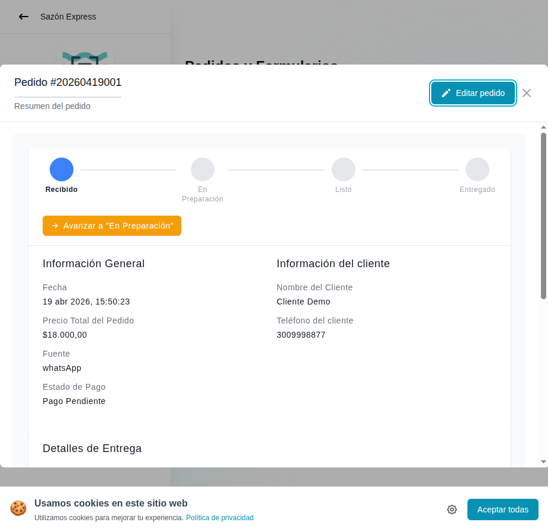

# 29 — Detalle de pedido (sin overlay)

- **URL:** `/menus/orders/orders?id=:id&orderId=:orderId`
- **Momento del flujo:** detalle del pedido limpio para lectura.

## Acción realizada (Playwright)

1. `browser_evaluate` que remueve `app-spotlight-overlay` del DOM.
2. `browser_take_screenshot` full-page.

## Elementos de UI observados

- Igual que captura 28 pero sin tooltip superpuesto.
- Vista limpia del stepper + info general + info cliente.
- Se ve que "Detalles de Entrega" continúa debajo (requiere scroll).

## Qué construir en el clon

- Misma implementación que 28.
- Añadir skeleton/loading para cada card (Suspense boundaries).
- En vista móvil, el drawer debe ser full-screen (`sheet` a pantalla
  completa) para mejor scroll.

## Observaciones técnicas

- El overlay anti-user de Angular bloqueaba pointer-events y provocó
  varios `TimeoutError` en Playwright. Para el clon, evitar overlays
  que intercepten clicks salvo durante carga real.
- Los spotlights del onboarding deben tener `pointer-events: none` y
  exceptuar solo el elemento destacado con `pointer-events: auto`.
