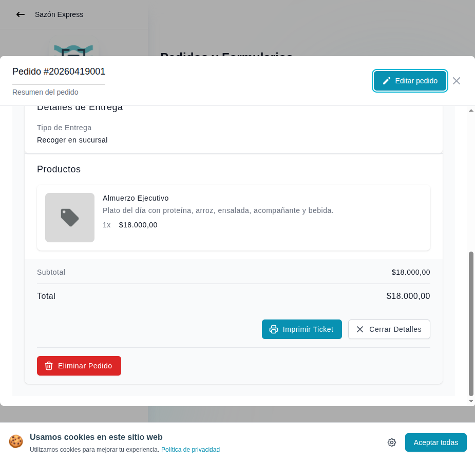

# 30 — Detalle de pedido (parte inferior)

- **URL:** `/menus/orders/orders?id=:id&orderId=:orderId`
- **Momento del flujo:** scroll al final del drawer de detalle.

## Acción realizada (Playwright)

1. `browser_evaluate` con `scrollTop = 9999` sobre el dialog.
2. `browser_take_screenshot` viewport.

## Elementos de UI observados

- Sección "Detalles de Entrega":
  - Tipo de Entrega: `Recoger en sucursal`.
- Sección "Productos":
  - Card por item con miniatura, nombre, descripción, cantidad y
    subtotal.
- Totales:
  - Subtotal.
  - Total (enfatizado).
- Botones de acción:
  - `Imprimir Ticket` (botón primario teal).
  - `Cerrar Detalles` (secundario).
  - `Eliminar Pedido` (destructivo, rojo, con ícono basura).

## Qué construir en el clon

- Componente `OrderItemsList` con snapshot de precios al momento del
  pedido (no recalcular).
- Componente `OrderTotalsBlock` con breakdown: subtotal, envío,
  descuento, impuestos (si aplica), total.
- `PrintTicketButton`:
  - Genera PDF 80mm (`@react-pdf/renderer` o plantilla HTML printable
    con `window.print()` + CSS `@page`).
  - Incluye logo, # pedido, fecha, items, totales, QR del pedido.
- `DeleteOrderButton`:
  - Confirmación con `AlertDialog`.
  - Server Action `orders.delete(id)` → soft-delete
    (`deleted_at`) para mantener histórico contable.
  - Permiso `orders:delete` requerido (rol owner/admin).

## Snapshot de items

- Los ítems en `orders.items_json` se guardan con nombre, precio y
  descripción **congelados** del momento del pedido.
- Aunque el producto cambie luego, el pedido muestra lo que vio el
  cliente.
