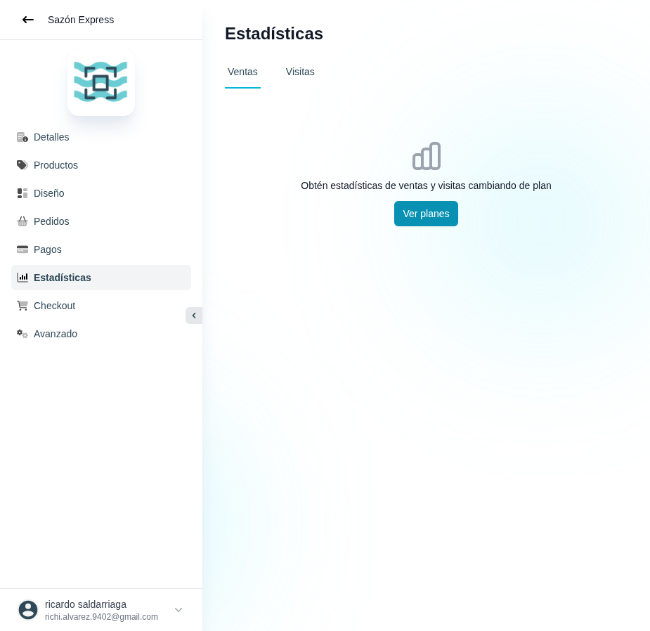

# 31 — Estadísticas · tab Ventas (estado sin plan)

- **URL:** `/menus/menu-analytics?menuId=:id&id=:id`
- **Momento del flujo:** primera visita al módulo Estadísticas en plan
  Gratis.

## Acción realizada (Playwright)

1. `browser_navigate` a la URL.
2. `browser_take_screenshot` full-page.

## Elementos de UI observados

- Título "Estadísticas".
- Tabs: `Ventas` (activo) / `Visitas`.
- Estado vacío con ícono de gráfico, mensaje invitando a mejorar plan
  y CTA "Ver planes".

## Qué construir en el clon

- Ruta `app/app/catalogs/[id]/analytics/page.tsx`.
- Tabs con query param (`?tab=sales|visits`).
- Gating por plan: si plan < Basic → mostrar `EmptyStateUpgradeCard`
  con CTA a `/app/billing`.
- Componente reutilizable `UpgradePromptCard({minPlan})`.

## Seeds métricos sugeridos (cuando esté habilitado)

- Ventas: ingresos totales, tickets, ticket promedio, top productos,
  top categorías, serie temporal.
- Visitas: page views, usuarios únicos, sesiones, fuentes de tráfico,
  conversión.
