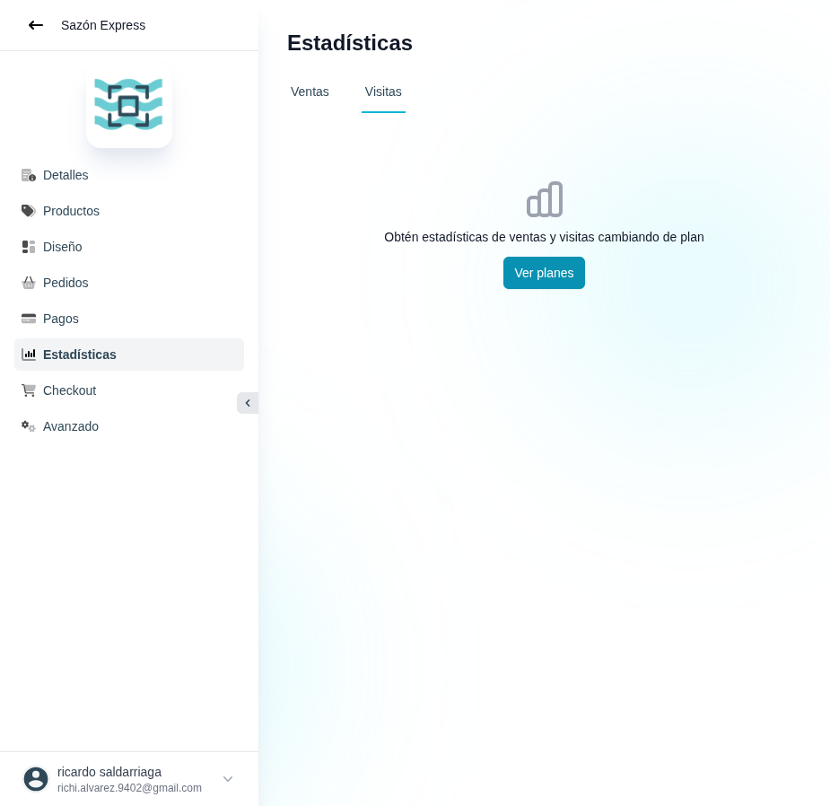

# 32 — Estadísticas · tab Visitas (estado sin plan)

- **URL:** `/menus/menu-analytics?menuId=:id&id=:id` (tab Visitas)
- **Momento del flujo:** igual que 31 pero con tab Visitas activo.

## Acción realizada (Playwright)

1. `browser_evaluate` click en tab `Visitas`.
2. `browser_take_screenshot` full-page.

## Elementos de UI observados

- Estado vacío idéntico al de Ventas (ambas métricas están detrás del
  mismo gating de plan).

## Qué construir en el clon

- Componente `AnalyticsTab` parametrizado por `type: 'sales' | 'visits'`.
- Reutilizar `UpgradePromptCard` con prop `feature='analytics'`.
- Si plan permite: renderizar `VisitsChart`, `TrafficSources`,
  `TopPages`.

## Datos de visitas (modelo)

- `analytics_events` con `type in ('page_view','product_view',
  'add_to_cart','checkout_started','order_placed')`.
- Agregación por `catalog_id + date` en vista materializada para
  dashboards rápidos.
