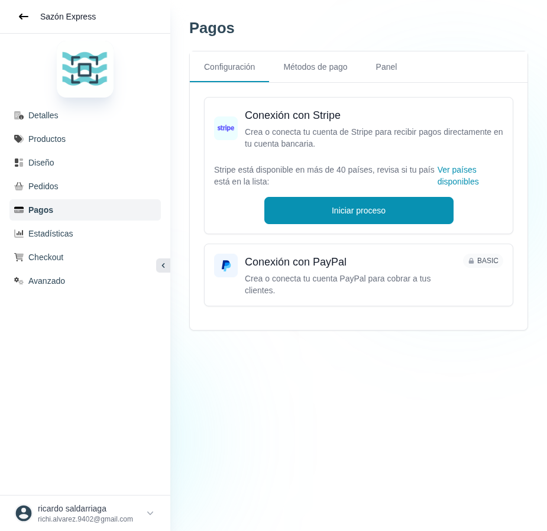

# 33 — Pagos · Configuración

- **URL:** `/menus/payments/setup?menuId=:id&id=:id`
- **Momento del flujo:** entrada al módulo Pagos.

## Acción realizada (Playwright)

1. Click en sidebar item `Pagos`.
2. `browser_take_screenshot` full-page.

## Elementos de UI observados

- Tabs: `Configuración` (activo) · `Métodos de pago` · `Panel`.
- Card **Conexión con Stripe**: logo, descripción, nota sobre 40+
  países y link "Ver países disponibles", CTA "Iniciar proceso".
- Card **Conexión con PayPal**: logo, descripción, badge `BASIC`
  (gating de plan).

## Qué construir en el clon

- Ruta `app/app/catalogs/[id]/payments/setup/page.tsx`.
- Componente `PaymentProviderCard` reutilizable (props: logo, title,
  description, minPlan, cta, connected).
- Server Actions:
  - `payments.stripe.startOnboarding(catalogId)` → genera account link
    Stripe Connect y redirige al comerciante.
  - `payments.paypal.connect(catalogId, clientId, secret)`.
- Tabla `payment_methods` (catalog_id, provider, credentials_json,
  enabled, onboarding_status).
- Guardrails: validar que el país del catálogo esté soportado por el
  proveedor antes de iniciar onboarding.

## Otros proveedores sugeridos (Colombia/LatAm)

- MercadoPago, Wompi, ePayco, PSE (transferencias), Nequi/Daviplata.
