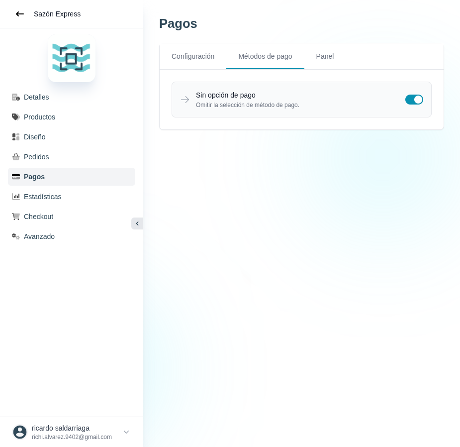

# 34 — Pagos · Métodos de pago

- **URL:** `/menus/payments/methods?menuId=:id&id=:id`
- **Momento del flujo:** tab Métodos de pago dentro de Pagos.

## Acción realizada (Playwright)

1. Click en tab "Métodos de pago".
2. `browser_take_screenshot` full-page.

## Elementos de UI observados

- Lista de métodos con toggle on/off a la derecha.
- Único ítem visible: **Sin opción de pago** (activado por defecto) —
  permite que el cliente salte la selección de pago.

## Qué construir en el clon

- Ruta `app/app/catalogs/[id]/payments/methods/page.tsx`.
- Lista ordenable de métodos disponibles:
  - `no_payment` (default)
  - `stripe_card`
  - `paypal`
  - `cash`
  - `bank_transfer`
  - `custom` (PRO)
  - `mercadopago`, `wompi`, `nequi` (Colombia)
- Cada método = row con `enabled`, `position`, `config_json`.
- Drag-and-drop para reordenar, toggle inline, confirmación al
  desactivar si hay checkout en curso.

## UX

- Badge de plan junto a métodos premium.
- Sección "Agregar método de pago" con catálogo de proveedores (tarjeta
  por proveedor).
