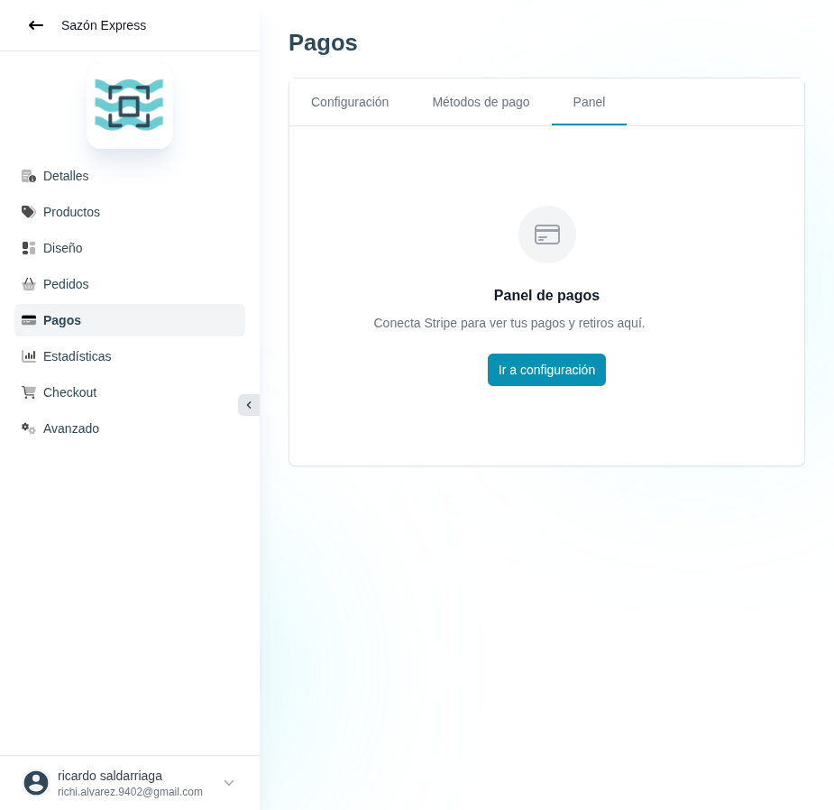

# 35 — Pagos · Panel

- **URL:** `/menus/payments/dashboard?menuId=:id&id=:id`
- **Momento del flujo:** tab Panel dentro de Pagos (sin cuenta Stripe
  conectada).

## Acción realizada (Playwright)

1. Click en tab "Panel".
2. `browser_take_screenshot` full-page.

## Elementos de UI observados

- Estado vacío: ícono tarjeta, título "Panel de pagos", subtítulo
  "Conecta Stripe para ver tus pagos y retiros aquí", CTA "Ir a
  configuración".

## Qué construir en el clon

- Ruta `app/app/catalogs/[id]/payments/dashboard/page.tsx`.
- Si no hay `payment_methods.provider='stripe'` conectado → mostrar
  empty state con CTA a tab Configuración.
- Si está conectado, mostrar:
  - KPI cards: Volumen procesado (período), Pagos exitosos, Tasa de
    conversión, Disputas.
  - Tabla de pagos recientes (pull-through desde Stripe via webhook o
    API ondemand).
  - Botón "Ver en Stripe" que abre Express Dashboard via
    `stripe.accounts.createLoginLink()`.

## Datos

- Sincronización con Stripe vía webhooks (`charge.succeeded`,
  `payout.paid`, `charge.refunded`) persistidos en `payments`.
- Polling on-demand como fallback.
