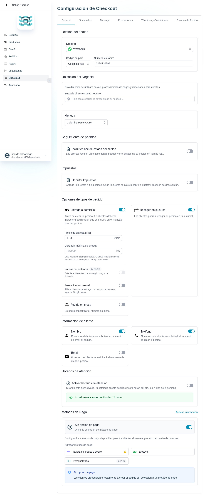

# 36 — Checkout · General

- **URL:** `/menus/shopping-cart/general?menuId=:id&id=:id`
- **Momento del flujo:** pantalla principal de configuración del
  checkout.

## Acción realizada (Playwright)

1. Click en sidebar `Checkout`.
2. `browser_take_screenshot` full-page.
3. `browser_evaluate` para listar headings, tabs y labels.

## Tabs del módulo Checkout

`General` · `Sucursales` · `Mensaje` · `Promociones` · `Términos y
Condiciones` · `Estados de Pedido`.

## Secciones observadas en General

1. **Destino del pedido** — Select de canal (WhatsApp|Email) + país +
   teléfono.
2. **Ubicación del Negocio** — Búsqueda de dirección (autocomplete
   Maps).
3. **Moneda** — Selector.
4. **Seguimiento de pedidos** — Toggle "Incluir enlace de estado del
   pedido".
5. **Impuestos** — Toggle + reglas.
6. **Opciones de tipos de pedido**:
   - Entrega a domicilio (toggle) con precio fijo, distancia máxima,
     precios por distancia (BASIC), sólo ubicación manual.
   - Recoger en sucursal (toggle).
   - Pedido en mesa (toggle, número de mesa).
7. **Información de cliente** — toggles Nombre, Teléfono, Email.
8. **Horarios de atención** — toggle + editor por día/hora.
9. **Métodos de Pago** — toggles por método; link "Más información".

## Qué construir en el clon

- Ruta `app/app/catalogs/[id]/checkout/general/page.tsx`.
- Formulario largo con secciones tipo `FormSection`.
- Toggles controlados por un único estado (`checkoutConfig`).
- Autosave por sección con debounce.
- Validaciones:
  - Si "Entrega a domicilio" activa y sin ubicación del negocio → error.
  - Si ambos toggles de pedido desactivados → error (al menos uno).
- Integración Google Places para el autocomplete (opcional).

## Modelo de datos

- `catalog_checkout_config` (catalog_id, channel, business_address_json,
  currency, tax_config_json, delivery_config_json, pickup_enabled,
  dine_in_enabled, required_customer_fields_json, business_hours_json).
