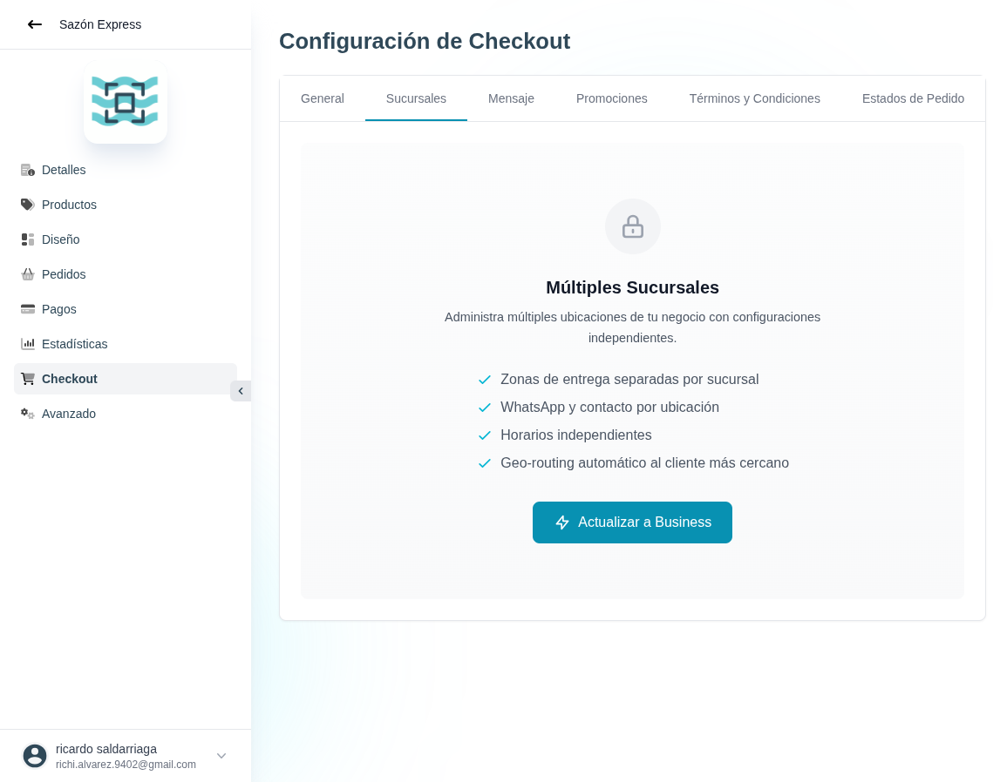

# 37 — Checkout · Sucursales (multi-branch)

- **URL:** `/menus/shopping-cart/branches?menuId=:id&id=:id`
- **Momento del flujo:** tab Sucursales dentro de Checkout.

## Acción realizada (Playwright)

1. Click en tab `Sucursales`.
2. `browser_take_screenshot` full-page.

## Elementos de UI observados

- Estado bloqueado (gating Business).
- Card "Múltiples Sucursales" con candado, descripción y bullets:
  - Zonas de entrega separadas por sucursal.
  - WhatsApp y contacto por ubicación.
  - Horarios independientes.
  - Geo-routing automático al cliente más cercano.
- CTA "Actualizar a Business".

## Qué construir en el clon

- Ruta `app/app/catalogs/[id]/checkout/branches/page.tsx`.
- Gating: si plan < Business → mostrar `FeatureLockCard(feature=
  'branches')` con CTA billing.
- Si desbloqueado:
  - CRUD de `branches` (id, name, address, phone, whatsapp,
    opening_hours, delivery_zones).
  - Editor de polígonos/zonas por sucursal (Leaflet/Mapbox).
  - Lógica de geo-routing: `pickNearestBranch(customer_location)`
    server-side.

## Modelo de datos

- `branches` (id, catalog_id, name, address, phone, whatsapp_phone,
  lat, lng, enabled).
- `branch_hours` (branch_id, day, open_time, close_time).
- `branch_zones` (branch_id, polygon_geom, fee, min_order).
