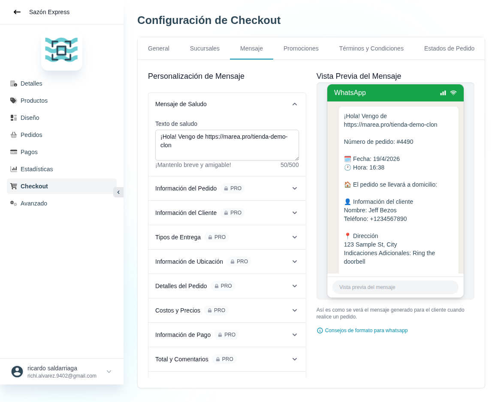

# 38 — Checkout · Mensaje (plantilla WhatsApp)



- **URL:** `/menus/shopping-cart/message?menuId=:id&id=:id`
- **Momento del flujo:** tab Mensaje dentro de Checkout.

## Acción realizada (Playwright)

1. Click en tab `Mensaje`.
2. `browser_take_screenshot` full-page.

## Elementos de UI observados

- Layout 2 columnas:
  - Izquierda: "Personalización de Mensaje" con acordeones expandibles.
  - Derecha: "Vista Previa del Mensaje" con una simulación del chat
    de WhatsApp (placeholder `Jeff Bezos`, dirección ficticia) en
    burbuja estilo WA.
- Acordeones:
  - **Mensaje de Saludo** (abierto): textarea editable con contador
    `50/500` + nota "Manténlo breve y amigable".
  - **Información del Pedido** (badge PRO).
  - **Información del Cliente** (badge PRO).
  - **Tipos de Entrega** (badge PRO).
  - **Información de Ubicación** (badge PRO).
  - **Detalles del Pedido** (badge PRO).
  - **Costos y Precios** (badge PRO).
  - **Información de Pago** (badge PRO).
  - **Total y Comentarios** (badge PRO).
- Link "Consejos de formato para whatsapp".

## Qué construir en el clon

- Ruta `app/app/catalogs/[id]/checkout/message/page.tsx`.
- Editor de plantilla con placeholders: `{{storefront_url}}`,
  `{{order_code}}`, `{{date}}`, `{{time}}`, `{{customer_name}}`,
  `{{customer_phone}}`, `{{address}}`, `{{items}}`, `{{subtotal}}`,
  `{{shipping}}`, `{{discount}}`, `{{total}}`, `{{payment_method}}`,
  `{{notes}}`.
- Componente `MessageTemplateSection`: toggle habilitar/deshabilitar +
  configuración por sección.
- Preview en tiempo real renderizado en un mock de burbuja WA (solo
  estilo; sin usar logos/colores oficiales que no tengamos derecho).
- Validación de longitud total del mensaje (< 4096 chars, límite wa.me).

## Modelo de datos

- `catalog_checkout_config.message_template_json`:
  ```json
  {
    "greeting": "string",
    "sections": {
      "order_info": { "enabled": true, "template": "..." },
      "customer_info": { "enabled": true, "template": "..." },
      ...
    }
  }
  ```

## Integración

- El constructor del mensaje (`buildWhatsAppOrderMessage`) consume esta
  plantilla en lugar de un template hardcoded.
