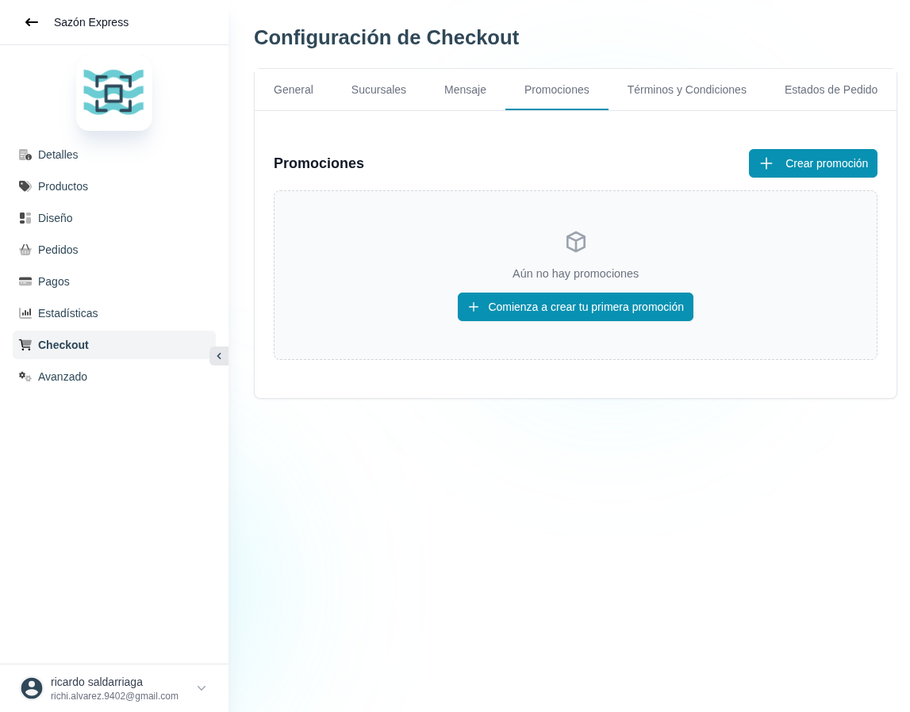

# 39 — Checkout · Promociones (listado vacío)

- **URL:** `/menus/shopping-cart/promotions?menuId=:id&id=:id`
- **Momento del flujo:** tab Promociones sin registros.

## Acción realizada (Playwright)

1. Click en tab `Promociones`.
2. `browser_take_screenshot` full-page.

## Elementos de UI observados

- Título "Promociones" + botón "+ Crear promoción" (top-right).
- Estado vacío con ícono de caja + texto "Aún no hay promociones" +
  CTA "+ Comienza a crear tu primera promoción".

## Qué construir en el clon

- Ruta `app/app/catalogs/[id]/checkout/promotions/page.tsx`.
- Lista de cupones/promociones en cards o tabla con columnas: Nombre,
  Tipo, Código, Valor, Inicio, Fin, Usos, Estado.
- Botón primario "Crear promoción" abre modal (ver captura 40).
- Filtros: activas / pausadas / expiradas.

## Modelo de datos

- `promotions` (id, catalog_id, name, type, code, value, start_at,
  end_at, max_uses, uses, active, conditions_json).
