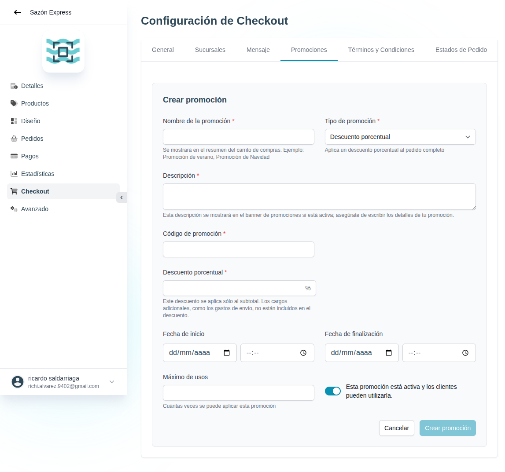

# 40 — Crear promoción (formulario)

- **URL:** `/menus/shopping-cart/promotions?menuId=:id&id=:id` (modal)
- **Momento del flujo:** clic en CTA "Crear promoción".

## Acción realizada (Playwright)

1. `browser_evaluate` click en "Crear promoción".
2. `browser_take_screenshot` full-page.
3. Posterior `browser_evaluate` click en "Cancelar" para cerrar.

## Campos observados

- **Nombre de la promoción** (requerido) — se muestra en resumen.
- **Tipo de promoción** (select): Descuento porcentual (default).
  Otros tipos esperables: monto fijo, envío gratis, 2x1, regalo.
- **Descripción** (requerido) — se muestra en banner de promociones.
- **Código de promoción** (requerido) — case-insensitive.
- **Descuento porcentual** (requerido, %) — nota: solo aplica al
  subtotal (excluye envío).
- **Fecha de inicio** / **Fecha de finalización** (fecha + hora).
- **Máximo de usos** (cuántas veces puede usarse).
- Toggle de activación "Esta promoción está activa y los clientes
  pueden utilizarla".
- Botones Cancelar / Crear promoción.

## Qué construir en el clon

- Componente `PromotionForm` con `react-hook-form` + `zod`:
  - `type: 'percentage' | 'fixed' | 'free_shipping' | 'bogo' | 'gift'`.
  - Condicional del bloque de valor según `type`.
  - `code` único por catálogo (case-insensitive check server-side).
  - Validación `end_at > start_at`.
- Server Action `promotions.create(catalogId, payload)`.
- En el checkout, validar código con `promotions.validate(code, cart)`:
  - activa, dentro de rango, usos disponibles, cumple condiciones.
  - Aplica al subtotal, no al envío.

## Modelo de datos (ampliado)

- `promotion_redemptions` (promotion_id, order_id, customer_phone_hash,
  amount_discounted, redeemed_at) para auditoría/analítica.
