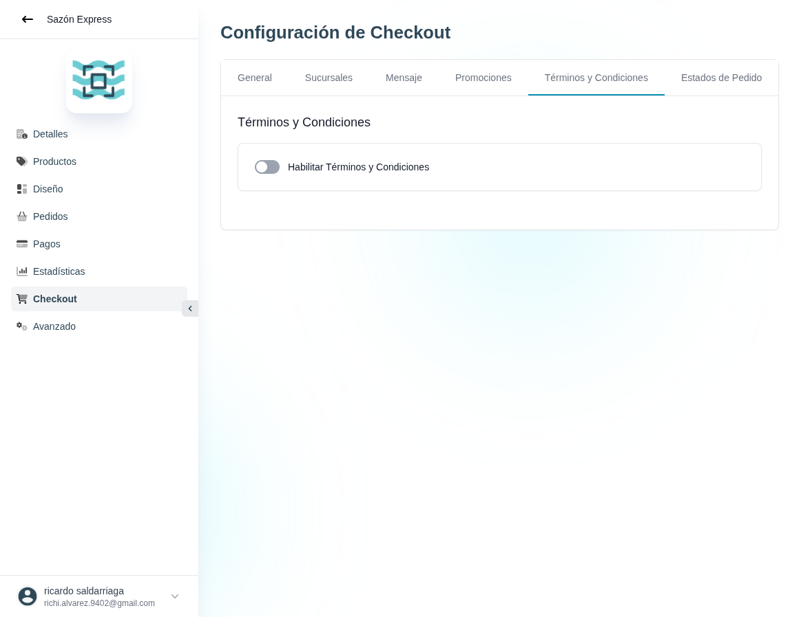

# 41 — Checkout · Términos y Condiciones

- **URL:** `/menus/shopping-cart/terms?menuId=:id&id=:id`
- **Momento del flujo:** tab Términos y Condiciones dentro de Checkout.

## Acción realizada (Playwright)

1. Click en tab "Términos y Condiciones".
2. `browser_take_screenshot` full-page.

## Elementos de UI observados

- Título "Términos y Condiciones".
- Toggle principal "Habilitar Términos y Condiciones" (desactivado).
- Al activar (no explorado) debería mostrarse un editor rich text y
  la opción de obligar aceptación en checkout.

## Qué construir en el clon

- Ruta `app/app/catalogs/[id]/checkout/terms/page.tsx`.
- Toggle `terms_enabled`.
- Editor rich text (TipTap o MDX) con placeholders de marca, dirección,
  nombre, política de devoluciones.
- Checkbox en el checkout del cliente: "Acepto los términos y
  condiciones" (requerido si `terms_enabled`).
- Guardar en cada pedido `orders.terms_accepted_at` y `terms_version`.

## Modelo de datos

- `catalog_terms` (catalog_id, version, content_mdx, published_at).
- `orders.terms_version` para trazabilidad legal.
