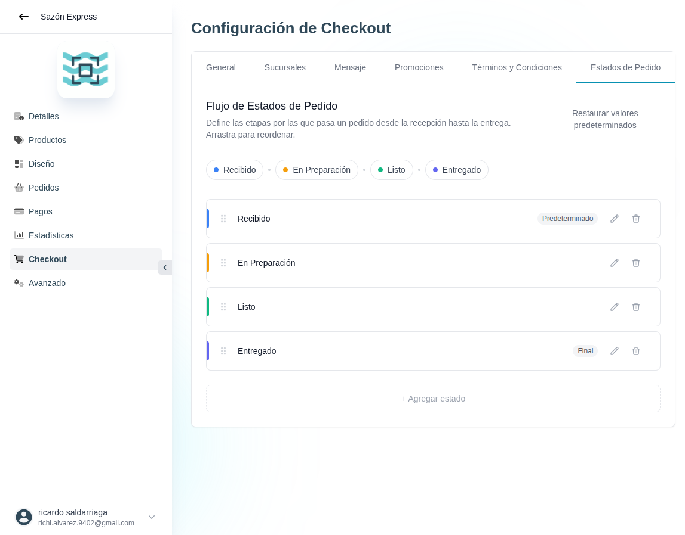

# 42 — Checkout · Estados de Pedido (flujo editable)

- **URL:** `/menus/shopping-cart/order-statuses?menuId=:id&id=:id`
- **Momento del flujo:** tab Estados de Pedido dentro de Checkout.

## Acción realizada (Playwright)

1. Click en tab `Estados de Pedido`.
2. `browser_take_screenshot` full-page.

## Elementos de UI observados

- Título "Flujo de Estados de Pedido" + subtítulo "Define las etapas
  por las que pasa un pedido desde la recepción hasta la entrega.
  Arrastra para reordenar."
- Link "Restaurar valores predeterminados".
- Visualización horizontal con pills de colores:
  Recibido → En Preparación → Listo → Entregado.
- Lista vertical editable:
  - Recibido (badge "Predeterminado") + editar + eliminar.
  - En Preparación + editar + eliminar.
  - Listo + editar + eliminar.
  - Entregado (badge "Final") + editar + eliminar.
- Botón "+ Agregar estado".

## Qué construir en el clon

- Ruta `app/app/catalogs/[id]/checkout/order-statuses/page.tsx`.
- Componente `OrderStatusFlowEditor`:
  - Drag-and-drop con `dnd-kit` para reordenar.
  - Un estado marcado como `is_initial` (default), otro como
    `is_final` (entrega completada).
  - Colores customizables por estado (picker).
  - Edición inline: nombre, color, notificar cliente sí/no.
- Server Action `orderStatuses.saveFlow(catalogId, statuses[])`.
- Restricciones:
  - Mínimo 2 estados (inicial + final).
  - Nombres únicos dentro del catálogo.

## Modelo de datos

- `order_statuses` (id, catalog_id, name, color, position, is_initial,
  is_final, notify_customer, template_message_id?).
- `orders.status_id` foreign key.
- Historial: `order_status_changes` (order_id, from, to, by, at).
