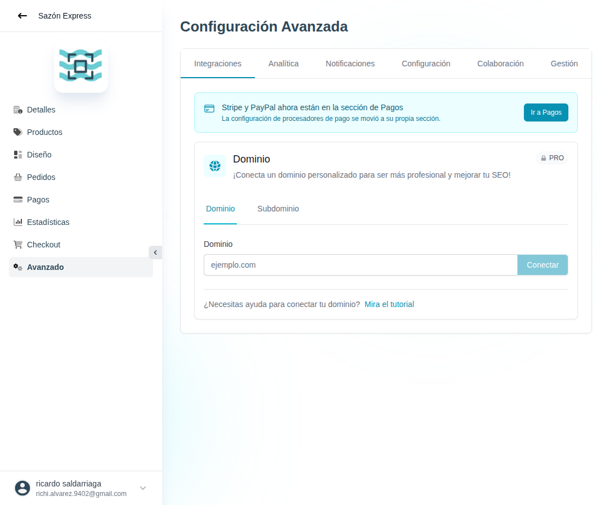

# 43 — Avanzado · Integraciones (Dominio)

- **URL:** `/menus/menu-advanced-config/integrations?menuId=:id&id=:id`
- **Momento del flujo:** entrada al módulo Avanzado.

## Tabs del módulo Avanzado

`Integraciones` · `Analítica` · `Notificaciones` · `Configuración` ·
`Colaboración` · `Gestión`.

## Acción realizada (Playwright)

1. Click en sidebar `Avanzado`.
2. `browser_take_screenshot` full-page.

## Elementos de UI observados

- Banner informativo: "Stripe y PayPal ahora están en la sección de
  Pagos" con CTA "Ir a Pagos".
- Card **Dominio** (badge `PRO`):
  - Subtabs: Dominio · Subdominio.
  - Input "ejemplo.com" + CTA "Conectar" (disabled por gating).
  - Link "Mira el tutorial".

## Qué construir en el clon

- Ruta `app/app/catalogs/[id]/advanced/integrations/page.tsx`.
- Card de Dominio con dos modos:
  - **Dominio propio** (PRO): input `example.com` + botón Conectar →
    verifica CNAME / A record → emite SSL (Vercel/Caddy).
  - **Subdominio** (Free/Basic): input para cambiar subdominio del
    SaaS (`miempresa.dominio-clon.com`).
- Server Action `domains.verify(domain)` que comprueba DNS.
- Integración con Vercel Domains API (o proxy propio).
- Estados: pendiente_dns, verificando, ssl_emitiendo, activo, error.

## Modelo de datos

- `catalog_domains` (catalog_id, domain, type ('apex'|'subdomain'),
  status, verified_at, ssl_status, last_check_at).
