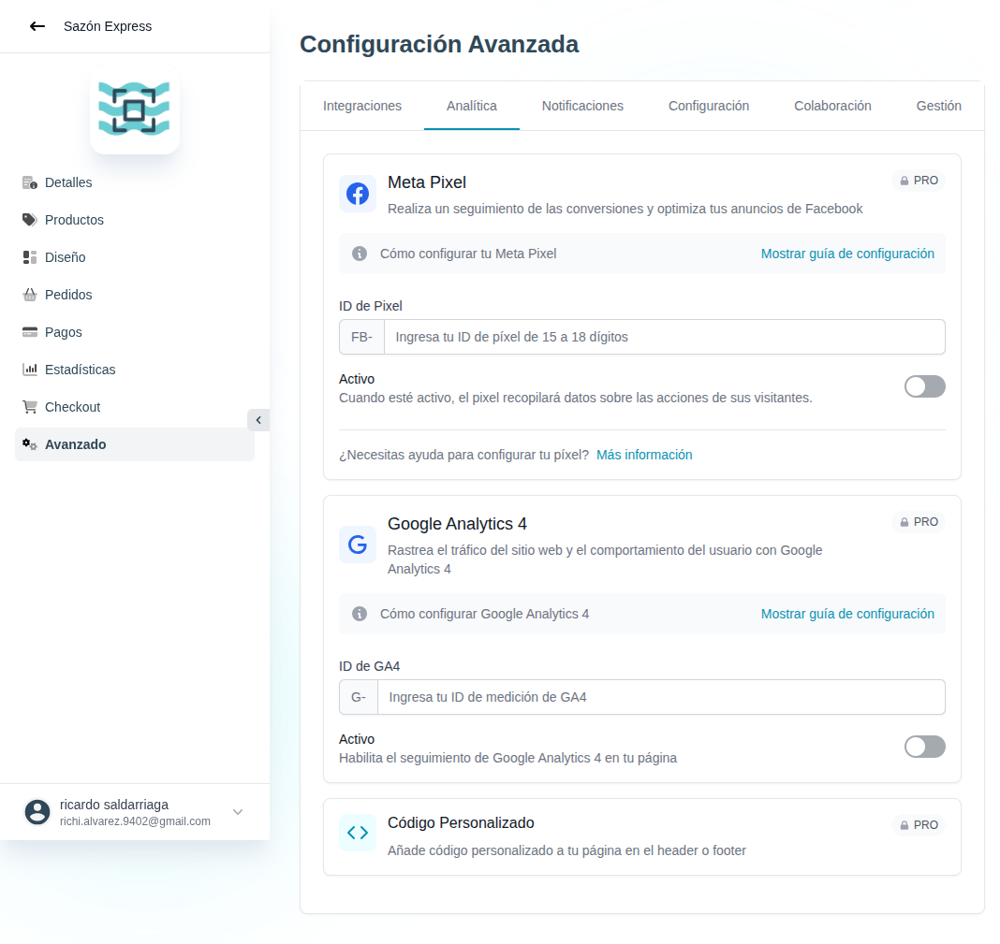

# 44 — Avanzado · Analítica (tracking de terceros)



- **URL:** `/menus/menu-advanced-config/analytics?menuId=:id&id=:id`
- **Momento del flujo:** tab Analítica dentro de Avanzado.

## Acción realizada (Playwright)

1. Click en tab `Analítica`.
2. `browser_take_screenshot` full-page.

## Elementos de UI observados

- Card **Meta Pixel** (PRO): prefijo `FB-` + input ID (15-18 dígitos)
  + toggle Activo + link "Mostrar guía de configuración".
- Card **Google Analytics 4** (PRO): prefijo `G-` + input ID + toggle
  Activo + guía.
- Card **Código Personalizado** (PRO): insertar HTML/JS en header o
  footer.

## Qué construir en el clon

- Ruta `app/app/catalogs/[id]/advanced/analytics/page.tsx`.
- Form con 3 secciones: Meta Pixel, GA4, Custom Code.
- Persistir en `catalog_analytics_config`:
  ```ts
  {
    meta_pixel: { id, active },
    ga4: { id, active },
    custom_code: { header_html, footer_html, active }
  }
  ```
- Renderizar los scripts en `layout.tsx` del storefront de ese slug.
- Sanitizar `custom_code` — ejecutar como `<Script strategy="afterInteractive">` con CSP compatible.
- Respeto a cookie consent: no cargar pixel/GA hasta tener consent.

## Eventos a enviar a ambos tracking

- `ViewContent` (vista de producto).
- `AddToCart`.
- `InitiateCheckout`.
- `Purchase` (al completar pedido).
