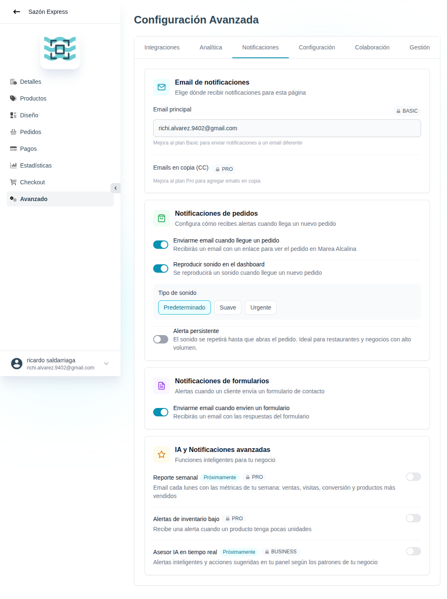

# 45 — Avanzado · Notificaciones



- **URL:** `/menus/menu-advanced-config/notifications?menuId=:id&id=:id`
- **Momento del flujo:** tab Notificaciones dentro de Avanzado.

## Acción realizada (Playwright)

1. Click en tab `Notificaciones`.
2. `browser_take_screenshot` full-page.

## Secciones observadas

1. **Email de notificaciones** (BASIC): email principal (editable solo
   con upgrade), Emails en copia (CC) — PRO.
2. **Notificaciones de pedidos**:
   - Toggle "Enviarme email cuando llegue un pedido".
   - Toggle "Reproducir sonido en el dashboard".
   - Tipo de sonido: Predeterminado / Suave / Urgente (selector chips).
   - Toggle "Alerta persistente" (repite hasta abrir el pedido).
3. **Notificaciones de formularios**: toggle para enviar email al
   recibir respuestas de formularios.
4. **IA y Notificaciones avanzadas**:
   - Reporte semanal (PRO, Próximamente).
   - Alertas de inventario bajo (PRO).
   - Asesor IA en tiempo real (BUSINESS, Próximamente).

## Qué construir en el clon

- Ruta `app/app/catalogs/[id]/advanced/notifications/page.tsx`.
- Persistir en `catalog_notification_config`:
  ```ts
  {
    email_primary, email_cc: [],
    order: { email_on_new: bool, sound: { enabled, type, persistent } },
    forms: { email_on_new: bool },
    ai: { weekly_report, low_stock_alerts, realtime_advisor }
  }
  ```
- Componente `SoundPicker` con `<audio>` para preview cada tipo.
- En el dashboard del comerciante:
  - Server-Sent Events escuchan nuevos pedidos.
  - Al llegar un pedido, reproducir sonido y mostrar toast persistente
    si está activada "alerta persistente" (hasta click en el pedido).
- Cron semanal (Inngest/Vercel) que genera reporte y lo envía con
  Resend si `weekly_report.enabled`.

## Roadmap

- "Próximamente" se renderiza como badge; el toggle está visible pero
  disabled para crear expectativa.
