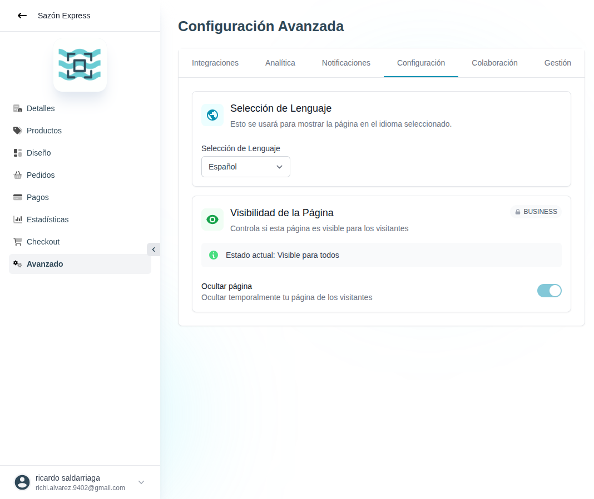

# 46 — Avanzado · Configuración

- **URL:** `/menus/menu-advanced-config/settings?menuId=:id&id=:id`
- **Momento del flujo:** tab Configuración dentro de Avanzado.

## Acción realizada (Playwright)

1. Click en tab `Configuración`.
2. `browser_take_screenshot` full-page.

## Secciones observadas

1. **Selección de Lenguaje**: dropdown "Español" (default).
2. **Visibilidad de la Página** (BUSINESS):
   - Banner "Estado actual: Visible para todos".
   - Toggle "Ocultar página" con subtexto "Ocultar temporalmente tu
     página de los visitantes".

## Qué construir en el clon

- Ruta `app/app/catalogs/[id]/advanced/settings/page.tsx`.
- Selector de idioma conectado a `catalogs.locale` → afecta SEO, emails
  y textos autogenerados.
- Toggle `catalogs.hidden`:
  - Si true → el storefront devuelve `404` o página "Tienda
    temporalmente cerrada".
  - Revalidate ISR.
- Gating por plan (BUSINESS) con `FeatureLockCard`.

## Modelo de datos

- `catalogs.locale` (enum `es | en | pt`).
- `catalogs.hidden_at` (nullable timestamp para saber desde cuándo).
