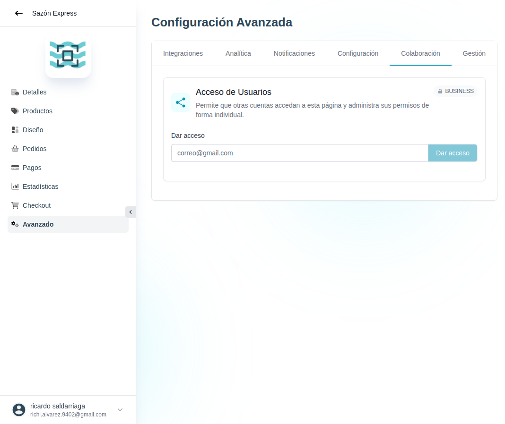

# 47 — Avanzado · Colaboración

- **URL:** `/menus/menu-advanced-config/sharing?menuId=:id&id=:id`
- **Momento del flujo:** tab Colaboración dentro de Avanzado.

## Acción realizada (Playwright)

1. Click en tab `Colaboración`.
2. `browser_take_screenshot` full-page.

## Elementos de UI observados

- Card "Acceso de Usuarios" (BUSINESS) con descripción "Permite que
  otras cuentas accedan a esta página y administra sus permisos de
  forma individual".
- Input email "correo@gmail.com" + botón "Dar acceso" (disabled hasta
  upgrade).

## Qué construir en el clon

- Ruta `app/app/catalogs/[id]/advanced/collaboration/page.tsx`.
- Invitaciones por email: `invites.create(catalog_id, email, role)` →
  envía mail con token que valida Auth.js o endpoint `/invites/:token`.
- Roles: `owner`, `admin`, `editor`, `viewer`, `order_manager`.
- Listar miembros activos con su rol (editable) y fecha de acceso.
- Log de auditoría: quién invitó, quién aceptó, quién revocó.
- Notificación al owner cuando alguien acepta.

## Modelo de datos

- `invites` (id, catalog_id|org_id, email, role, token, expires_at,
  accepted_at, invited_by).
- `memberships` (user_id, scope ('org'|'catalog'), scope_id, role).

## Permisos (matriz)

| Acción                   | owner | admin | editor | order_manager | viewer |
|--------------------------|-------|-------|--------|---------------|--------|
| Publicar / despublicar   |  ✓    |  ✓    |        |               |        |
| CRUD productos           |  ✓    |  ✓    |   ✓    |               |        |
| Ver/actualizar pedidos   |  ✓    |  ✓    |        |       ✓       |        |
| Ver analíticas           |  ✓    |  ✓    |   ✓    |       ✓       |   ✓    |
| Configurar pagos         |  ✓    |  ✓    |        |               |        |
| Eliminar catálogo        |  ✓    |       |        |               |        |
