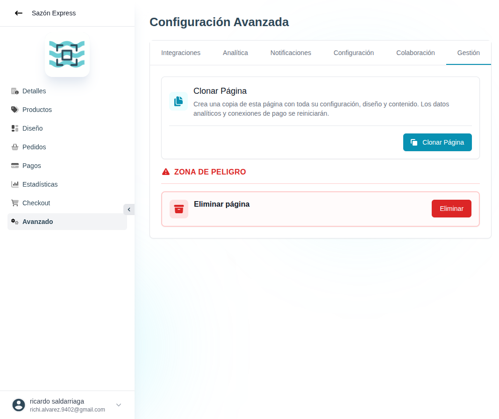

# 48 — Avanzado · Gestión (clonar / eliminar)

- **URL:** `/menus/menu-advanced-config/management?menuId=:id&id=:id`
- **Momento del flujo:** tab Gestión dentro de Avanzado.

## Acción realizada (Playwright)

1. Click en tab `Gestión`.
2. `browser_take_screenshot` full-page.

## Elementos de UI observados

- Card **Clonar Página** con descripción "Crea una copia de esta
  página con toda su configuración, diseño y contenido. Los datos
  analíticos y conexiones de pago se reiniciarán." + CTA "Clonar
  Página".
- Sección **ZONA DE PELIGRO** (texto rojo con ícono ⚠).
- Card **Eliminar página** con CTA rojo "Eliminar".

## Qué construir en el clon

- Ruta `app/app/catalogs/[id]/advanced/management/page.tsx`.

### Clonar catálogo

- Server Action `catalogs.clone(sourceId)`:
  - Copia filas de `catalogs`, `categories`, `products`, `blocks`,
    `catalog_checkout_config`, `order_statuses`.
  - **NO** copia: `orders`, `analytics_events`, `payment_methods`,
    `catalog_domains`, `catalog_analytics_config`.
  - Genera slug nuevo con sufijo `-copy-YYYYMMDD` y permite editarlo
    antes de confirmar.
  - Redirige al nuevo catálogo.
- Mostrar modal de confirmación con preview del slug destino.

### Eliminar catálogo

- Server Action `catalogs.delete(id)`:
  - Soft-delete (`deleted_at`) por default; purga real a los 30 días
    con cron.
  - Requiere typear el nombre del catálogo en un input de confirmación
    (patrón GitHub).
  - Solo `owner` puede ejecutarla.
  - Emite `catalog.deleted` → notifica a colaboradores.

## Modelo de datos / reglas

- `catalogs.deleted_at` + scheduled job de purga definitiva.
- `audit_log` (who, what, when, catalog_id) entrada tipo `catalog.cloned`
  o `catalog.deleted`.

## Seguridad

- Doble confirmación para destructivas.
- Rate-limit (1 acción destructiva / minuto / usuario).
- Enviar email al owner avisando de la acción y link para "Deshacer"
  (mientras esté en soft-delete).
